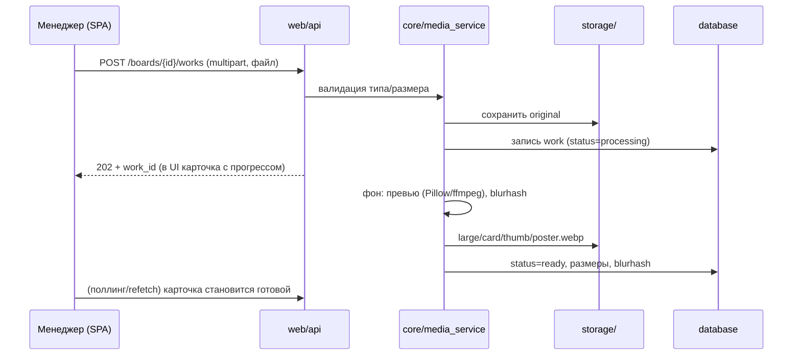

# 02 — Архитектура

## Стек

| Слой | Технология | Почему |
|---|---|---|
| Бэкенд | **Python 3.12 + FastAPI** | Требование проекта (Python); FastAPI — асинхронный, типизированный, автодокументация OpenAPI |
| ORM / миграции | **SQLAlchemy 2.0 + Alembic** | Абстракция над БД: SQLite сегодня, MySQL завтра — меняется строка подключения, не код |
| Валидация | **Pydantic v2** | Схемы запросов/ответов, конфигурация из env |
| Фронтенд CRM | **React 18 + TypeScript + Vite** | SPA для внутреннего инструмента: быстрая разработка, богатые интерактивные списки/формы |
| Фронтенд витрины | **React + SSR-шелл от FastAPI (Jinja2)** | Сервер отдаёт HTML с OG-мета-тегами и критическим контентом → мгновенный первый экран и красивые превью ссылок в мессенджерах; React гидрирует анимации и лайтбокс |
| Стили | **Tailwind CSS** | Быстрая вёрстка по дизайн-токенам; токены — единый источник для CRM и витрины |
| Анимации витрины | **Framer Motion** | Декларативные, прерываемые анимации; уважение `prefers-reduced-motion` |
| Обработка изображений | **Pillow** | Превью, WebP-версии, blurhash-плейсхолдеры |
| Обработка видео | **ffmpeg** (системный, вызов из Python) | Постеры видео, метаданные длительности |
| Фоновые задачи | **FastAPI BackgroundTasks** (MVP) | Генерация превью после загрузки; при росте — вынести в arq/celery |
| Веб-сервер | **uvicorn за nginx** | nginx отдаёт статику и медиа, терминирует TLS |
| Контейнеризация | **Docker + Docker Compose** | Один `docker compose up` на VPS |

## Структура каталогов

```
OpenCRM/
├── config/                     # Конфигурация
│   ├── settings.py             #   Pydantic Settings: env-переменные, пути, лимиты
│   ├── .env.example            #   шаблон окружения (без секретов)
│   └── logging.py              #   настройка логирования
│
├── core/                       # Доменная логика (не знает про HTTP и SQL напрямую)
│   ├── services/               #   бизнес-операции
│   │   ├── auth_service.py     #     регистрация, вход, одобрение аккаунтов
│   │   ├── client_service.py   #     клиенты, заметки, история
│   │   ├── board_service.py    #     доски, работы, порядок
│   │   ├── share_service.py    #     публичные ссылки: токены, PIN, срок, просмотры
│   │   ├── media_service.py    #     приём файлов, превью, blurhash, постеры видео
│   │   └── settings_service.py #     настройки сайта (бренд)
│   ├── security/               #   пароли (bcrypt), токены сессий, PIN-хэши
│   ├── exceptions.py           #   доменные ошибки → HTTP-коды на слое web
│   └── i18n/                   #   словари переводов интерфейсных писем/страниц (en, ru)
│
├── database/                   # Слой данных
│   ├── models/                 #   SQLAlchemy-модели (по одной на файл)
│   ├── repositories/           #   запросы к БД (только здесь пишем SQL/ORM-запросы)
│   ├── migrations/             #   Alembic
│   └── session.py              #   engine, фабрика сессий
│
├── web/                        # Слой HTTP
│   ├── api/                    #   REST API для CRM SPA (/api/v1/...)
│   │   ├── deps.py             #     зависимости: текущий пользователь, права
│   │   └── routes/             #     auth, clients, boards, works, shares, staff, settings
│   ├── public/                 #   публичные страницы витрины (/b/{token})
│   │   ├── routes.py           #     SSR-шелл + OG-теги, PIN-форма, страницы ошибок
│   │   └── templates/          #     Jinja2-шаблоны витрины
│   ├── frontend/               #   исходники React
│   │   ├── crm/                #     SPA CRM-интерфейса
│   │   ├── showcase/           #     бандл витрины (гидрация, лайтбокс, анимации)
│   │   └── shared/             #     дизайн-токены, общие компоненты, i18n-словари UI
│   └── main.py                 #   сборка FastAPI-приложения, монтирование роутеров
│
├── storage/                    # Файлы (в .gitignore, том Docker)
│   ├── media/                  #   оригиналы и производные работ
│   ├── client_files/           #   внутренние документы клиентов
│   └── branding/               #   логотип студии и пр.
│
├── docker/                     # Dockerfile, docker-compose.yml, конфиг nginx
├── scripts/                    # bootstrap root-аккаунта, бэкапы, обслуживание
├── tests/                      # pytest: unit (core), integration (api)
└── docs/                       # эта документация
```

### Правила зависимостей между слоями

```
web  ──►  core  ──►  database
 │                      ▲
 └── (только модели/схемы, никогда напрямую SQL) ─┘
```

- `web` вызывает сервисы `core`, никогда не лезет в репозитории напрямую.
- `core` работает с данными через репозитории `database`, не знает про FastAPI.
- `database` не знает ни о ком. Только модели и запросы.
- `config` импортируется отовсюду, сам не импортирует слои.

Это дисциплинирует код и делает переезд на MySQL / вынос фоновых задач / смену фронтенда локальными изменениями.

## Хранение файлов

Все загружаемые файлы — на диске сервера (том Docker), в БД — только метаданные и относительные пути.

```
storage/
├── media/
│   └── {board_id}/
│       └── {work_id}/
│           ├── original.{ext}      # исходник как загрузили
│           ├── large.webp          # 1920px по длинной стороне — лайтбокс
│           ├── card.webp           # 800px — карточка в сетке витрины
│           ├── thumb.webp          # 320px — списки в CRM
│           └── poster.webp         # только для видео: кадр-постер
├── client_files/
│   └── {client_id}/{file_id}_{safe_name}.{ext}
└── branding/
    └── logo.{ext}, favicon.{ext}, og-default.{ext}
```

Правила:

- Имена файлов на диске — только идентификаторы, оригинальное имя хранится в БД (защита от инъекций в путь и проблем с кодировками).
- Медиа витрины отдаёт nginx напрямую (`/media/...`) — быстро и без нагрузки на Python. Ссылки на производные файлы не секретны: секретность доски обеспечивает токен страницы, а сами файлы имеют непредсказуемые UUID-пути.
- Внутренние файлы клиентов (`client_files`) отдаются **только через приложение** с проверкой сессии сотрудника (`X-Accel-Redirect` для эффективности).

## Пайплайн загрузки работы



- Тип файла проверяется по сигнатуре (magic bytes), не по расширению.
- Изображения: JPG, PNG, WebP, GIF, SVG (SVG — санитайзинг, отдача с безопасным `Content-Type`).
- Видео: MP4 (H.264), WebM. Постер — кадр на 1-й секунде.
- Blurhash сохраняется в БД → витрина рисует размытые цветные плейсхолдеры до загрузки картинок.

## Витрина: почему SSR-шелл, а не чистая SPA

1. **OG-превью в мессенджерах.** Telegram/WhatsApp не исполняют JS. Сервер обязан отдать `<meta property="og:image" ...>` с обложкой доски — это то самое «красивое превью» при отправке ссылки.
2. **Скорость первого экрана.** HTML приходит уже с сеткой первых работ (blurhash-плейсхолдеры) — витрина «появляется» мгновенно, JS догружает интерактив.
3. **Надёжность.** Даже при сбое JS клиент увидит работы: базовая сетка и просмотр работают на чистом HTML/CSS.

CRM при этом остаётся обычной SPA — там SEO и мгновенный первый экран не нужны, а интерактивность важнее.

## Интернационализация

- Словари `en`/`ru` для CRM — в `web/frontend/shared/i18n/`; для серверных страниц (PIN, ошибки витрины) — в `core/i18n/`.
- Язык по умолчанию — **английский**.
- У сотрудника язык хранится в `users.locale`, применяется после входа на любом устройстве.
- Язык витрины задаётся в настройках сайта (root).

## Конфигурация

Всё через переменные окружения (Pydantic Settings), файл `config/.env.example` — источник правды по списку:

```
OPENCRM_ENV=production
OPENCRM_SECRET_KEY=...            # сессии
OPENCRM_DB_URL=sqlite:///data/opencrm.db   # позже: mysql+pymysql://...
OPENCRM_STORAGE_DIR=/app/storage
OPENCRM_ROOT_EMAIL=...            # bootstrap root при первом запуске
OPENCRM_ROOT_PASSWORD=...         # принудительная смена при первом входе
OPENCRM_MAX_UPLOAD_MB=200
OPENCRM_BASE_URL=https://studio.example.com   # для генерации публичных ссылок и OG
```
