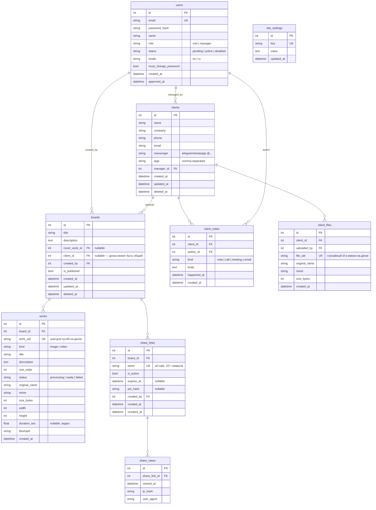

# 03 — База данных

## Принципы

- **SQLite сейчас, MySQL потом.** Поэтому: никаких диалект-специфичных фич (JSON-функций SQLite, `AUTOINCREMENT`-трюков, частичных индексов). Только то, что SQLAlchemy переносит без правок.
- Все таблицы — через SQLAlchemy-модели в `database/models/`, изменения схемы — только через миграции Alembic.
- Первичные ключи — целочисленные автоинкременты; внешние публичные идентификаторы (токены ссылок, идентификаторы файлов) — отдельные случайные строки, чтобы не светить порядковые номера наружу.
- Время — всегда UTC, колонки `*_at` типа `DateTime`.
- Клиенты удаляются мягко (`deleted_at`) и восстанавливаются root'ом; их файлы чистятся отложенно. Доски восстановления не имеют, поэтому удаляются сразу вместе с файлами работ (мягкое удаление лишь занимало бы место).

## Схема

## Пояснения к решениям

### users
- `role` — только `root` и `manager`. Root один, создаётся скриптом bootstrap при первом запуске (email/пароль из env, `must_change_password = true`).
- `status = pending` после регистрации: вход запрещён до одобрения. Root меняет на `active` (одобрить) или аккаунт удаляется (отклонить). `disabled` — уволенный сотрудник: вход запрещён, данные и авторство сохраняются.
- `locale` — выбранный язык интерфейса; по умолчанию `en`. Применяется при каждом входе с любого устройства.

### clients
- `tags` — строка с разделителями для MVP (поиск через LIKE). При переезде на MySQL и росте — вынести в таблицы `tags`/`client_tags` (заложено в план, изменение локальное благодаря репозиторию).
- `manager_id` — «ответственный» менеджер; на права видимости в MVP не влияет (видят все сотрудники), только отображается.

### boards / works
- `works.sort_order` — целое с шагом 10 (10, 20, 30...): drag-and-drop меняет порядок без переписывания всех строк.
- `cover_work_id` — обложка доски: показывается в списках CRM и в OG-превью ссылки. По умолчанию — первая работа.
- `is_published` — черновик/опубликована. Неопубликованная доска по ссылке показывает «доступ закрыт» даже при активном токене — менеджер может спокойно готовить контент.
- `works.status = processing` — файл загружен, превью ещё генерируются; витрина такие работы не показывает, CRM показывает с индикатором.

### share_links
- Токен — `secrets.token_urlsafe(16)` → 22 url-safe символа, неугадываемый. Уникален глобально.
- У доски может быть **несколько** ссылок одновременно (например, разным клиентам с разными PIN и сроками) — поэтому отдельная таблица, а не поля в `boards`.
- «Перегенерировать» = отозвать текущую (`is_active = false, revoked_at = now`) + создать новую. История сохраняется.
- `pin_hash` — bcrypt от PIN; сам PIN показывается менеджеру один раз при установке.
- Проверка доступности ссылки (все условия обязаны выполняться): `is_active = true` **и** (`expires_at` пуст **или** в будущем) **и** доска `is_published = true` **и** доска не удалена.

### share_views
- Пишется одна запись на просмотр (открытие страницы с успешным доступом; ввод PIN — после успешного ввода).
- `ip_hash` — хэш IP с солью, не сырой адрес: достаточно для отличия уникальных посетителей, без хранения персональных данных.
- Агрегаты для CRM (`count`, `last viewed`) считаются запросом; при росте — денормализовать счётчик в `share_links`.

### site_settings
- Ключ-значение: `brand_name`, `brand_logo_path`, `contact_email`, `contact_phone`, `social_telegram`, `showcase_locale`, `og_default_image` и т.п.
- Редактирует только root. Кэшируется в памяти процесса с инвалидацией при записи.

## Жизненный цикл файлов и освобождение места

| Действие | Что с файлами |
|---|---|
| Удалить работу | файлы удаляются сразу (в т.ч. из менеджера файлов, root) |
| Удалить **ссылку** на доску | файлы **не трогаются** — они принадлежат доске, а у доски может быть несколько ссылок; удаление одной не должно ломать остальные |
| Удалить **доску** | доска, её работы, ссылки и просмотры удаляются сразу; файлы работ стираются с диска (восстановления досок нет — каскад `ondelete=CASCADE`) |
| Удалить **клиента** | мягкое удаление: запись скрыта, файлы лежат до очистки корзины (клиента можно восстановить) |
| Очистить корзину (root) или `purge_deleted.py` | мягко удалённые клиенты и их файлы удаляются безвозвратно, место освобождается |

Объём корзины (мягко удалённые клиенты) виден в карточке «Хранилище». Автоматика: cron с карантином 30 дней, см. [08-deployment.md](08-deployment.md). Обзор всех медиафайлов досок с размером/датами и точечным удалением — менеджер файлов (root), см. [05-crm-design.md](05-crm-design.md).

## Регистронезависимый поиск

Встроенные `lower()`/`upper()` в SQLite работают только с ASCII: `lower('Брусника')` возвращает строку без изменений, поэтому `ilike` (SQLAlchemy эмулирует его через `lower()`) не находил русские названия, набранные в другом регистре. В [database/session.py](../database/session.py) обе функции подменяются Python-реализациями через `create_function` — это чинит поиск во всех репозиториях сразу и не требует диалектных веток в запросах.

При переезде на MySQL подмена не нужна: сравнение в `utf8mb4_general_ci` регистронезависимо нативно.

## Индексы

| Таблица | Индекс | Зачем |
|---|---|---|
| users | `email` (unique) | вход |
| clients | `name`, `manager_id`, `deleted_at` | списки и поиск |
| client_notes | `(client_id, happened_at)` | лента карточки |
| works | `(board_id, sort_order)` | вывод доски по порядку |
| share_links | `token` (unique) | открытие витрины — самый горячий запрос |
| share_views | `(share_link_id, viewed_at)` | статистика |

## Миграция SQLite → MySQL

1. Все типы уже переносимые; Alembic-миграции написаны без диалектных веток.
2. Перенос данных: скрипт `scripts/migrate_to_mysql.py` — читает через SQLAlchemy из SQLite, пишет в MySQL (порядок: users → clients → boards → works → остальное).
3. Меняется `OPENCRM_DB_URL`, прогоняются миграции на пустой MySQL, затем перенос, затем переключение приложения.
4. Файлы в `storage/` не затрагиваются — пути в БД относительные.
5. После переезда: `utf8mb4`, движок InnoDB — задаётся в Alembic `env.py` через `mysql_*`-аргументы, SQLite их игнорирует.
