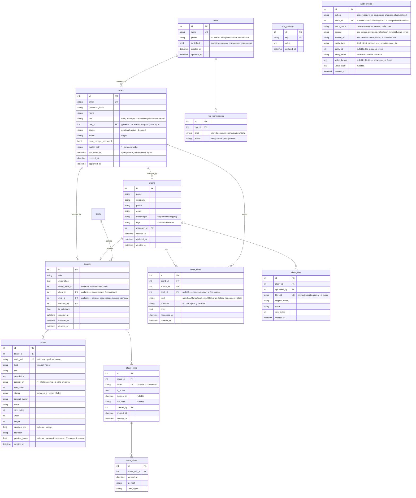
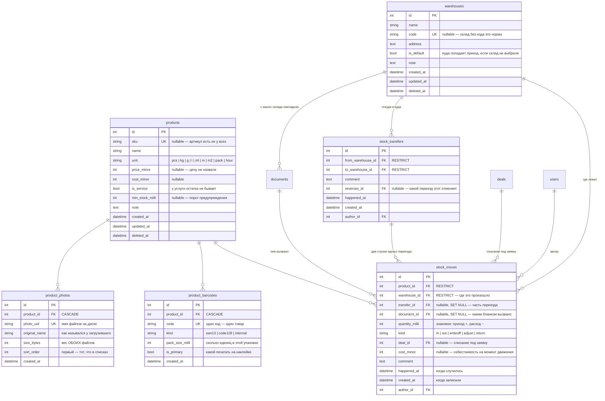

# 03 — База данных

## Принципы

- **База одна — MySQL.** Частичных индексов в ней нет, поэтому инварианты «ровно один» держатся запросами; диалектных веток в запросах нет тоже — тонкости движка собраны в `database/types.py` и `database/query.py`, а не размазаны по репозиториям.
- Все таблицы — через SQLAlchemy-модели в `database/models/`, изменения схемы — только через миграции Alembic.
- Первичные ключи — целочисленные автоинкременты; внешние публичные идентификаторы (токены ссылок, идентификаторы файлов) — отдельные случайные строки, чтобы не светить порядковые номера наружу.
- Время — всегда UTC, колонки `*_at` типа `DateTime`.
- Клиенты удаляются мягко (`deleted_at`), а восстанавливает их обладатель права `clients.restore` (у root оно есть всегда); их файлы чистятся отложенно. Доски восстановления не имеют, поэтому удаляются сразу вместе с файлами работ (мягкое удаление лишь занимало бы место).

## Схема

Диаграмма ниже — **ядро**: сотрудники с должностями, клиенты, доски и публичные
ссылки. Остальное разобрано своими разделами (почта, склад, финансы, телефония,
журнал, телеграм). Всего таблиц тридцать восемь плюс служебная `alembic_version`;
живой перечень — `grep __tablename__ database/models/`.



### Таблицы, у которых своей схемы здесь нет

Половине таблиц диаграмма не нужна: две-три колонки и ни одного решения, которое
стоило бы объяснять. Но перечень, выглядящий полным и таковым не являющийся,
хуже короткого — поэтому они названы, по строке на каждую.

| Таблица | Что хранит |
|---|---|
| `user_sessions` | сессии входа: `token_hash` (unique), владелец, срок |
| `companies` | свои юрлица — от чьего имени печатается бланк. «Основная» ровно одна, держится запросом |
| `deals` | заявки: клиент, менеджер, фирма, ключ этапа (**не** внешний ключ), сумма и полученное, сроки, `deleted_at` |
| `deal_stage_changes` | кто и когда передвинул заявку: `from_stage` → `to_stage`. Из него считается «сколько простояла в этапе» |
| `pipeline_stages` | справочник этапов: `key` (unique), название, вид (`open`/`won`/`lost`), порядок, `is_archived` — этапы прячут, а не удаляют |
| `documents`, `document_lines`, `document_events` | бланки, строки перечня и история состояний бланка. Перечень общий **у заказа, акта и накладной** (`LINE_KINDS` в `database/models/document.py`). Было сказано «у заказа и акта» — накладная взяла ту же таблицу с `b8d41f7a2c95`, потому что две параллельные системы строк это два места счёта денег, и расходятся они не сразу, а постепенно |
| `finance_categories` | статьи: `direction` (`income`/`expense`), `purpose` (`general`/`tax`/`salary`). Удаление мягкое, уникальности имени нет намеренно |
| `finance_budgets` | план по статье на период. `UNIQUE (category_id, period_start, period_end)` — тот редкий инвариант «ровно один», который держит СУБД |
| `tasks` | напоминания: срок, исполнитель, необязательные клиент и заявка |
| `message_templates` | типовые тексты с подстановками; где применим — `email`, `note` или `any` |
| `module_states` | включён ли блок. Какие блоки бывают, знает `core/modules.py`, а не база |
| `deal_lines` | что продаём по заявке: товары, услуги из прайса и свои траты — одной таблицей. Решения ниже, разбор — [19-sborka-zakaza.md](19-sborka-zakaza.md) |
| `snake_scores` | счёт со страницы обслуживания; адрес — хэшем, той же солью, что у просмотров витрины |

## Пояснения к решениям

### users
- `role` — только `root` и `manager`, и это **не должность, а признак владельца системы**. Набор прав живёт в `role_id`; у root его нет и быть не может — права у него все и всегда, иначе можно было бы собрать конфигурацию, в которой раздать их обратно уже некому. Первый root создаётся скриптом bootstrap при первом запуске (email/пароль из env, `must_change_password = true`). Дальше root может сделать root'ом активного сотрудника, поэтому владельцев может быть несколько; система следит, чтобы хотя бы один остался (см. [07-security.md](07-security.md)).
- `role_id` — должность с набором прав, `ON DELETE SET NULL`: удаление роли не должно уносить людей. Пусто — прав нет никаких. Роль в работе удалить нельзя (`role_in_use`), так что «пусто» появляется только осознанным снятием.
- `status = pending` после регистрации: вход запрещён до одобрения. На `active` его меняет обладатель права `staff.manage` (одобрить) или аккаунт удаляется (отклонить). `disabled` — уволенный сотрудник: вход запрещён, данные и авторство сохраняются. Аккаунт можно и удалить окончательно (`DELETE /staff/{id}`): запись и сессии стираются, но авторство в клиентах/досках/заметках/файлах обнуляется (`ON DELETE SET NULL`), а не удаляется.
- `locale` — выбранный язык интерфейса; по умолчанию `en`. Применяется при каждом входе с любого устройства.

### roles / role_permissions
- **Что бывает — знает код, кому выдано — база.** Реестр прав в `core/permissions.py`, здесь только выдача. Строка с областью, которой больше нет в реестре, ничего не даёт: проверка идёт от реестра, а не от таблицы.
- Право — **строкой, а не списком в одной колонке**: по правам спрашивают («кто может менять роли»), а не читают их целиком. Список в тексте пришлось бы разбирать в приложении на каждый такой вопрос, и инвариант «последний управляющий правами» проверялся бы перебором всех ролей. `UNIQUE (role_id, area, action)` — дубль не ошибка данных, а мусор, который живёт своей жизнью: снимаешь право, а оно остаётся.
- `is_default` — ровно одна роль, и следит за этим **сервис, а не база**, ровно как с основной фирмой: частичный уникальный индекс (`UNIQUE ... WHERE is_default`) в MySQL не существует вовсе, а обычный `UNIQUE` запретил бы двум ролям одновременно *не* быть основной.
- `preset` — из какого готового набора роль выросла, только для показа. Сверяться с пресетом никто не будет: набор в нём может измениться с обновлением, а права роли после создания живут своей жизнью.

### clients
- `tags` — строка с разделителями для MVP (поиск через LIKE). При росте — вынести в таблицы `tags`/`client_tags`; изменение локальное благодаря репозиторию, наружу оно не выходит.
- `source` — откуда пришёл клиент: стабильный строковый ключ (`referral`, `search`, `social`, `ads`, `site`, `repeat`, `other`) либо своё значение. `site` ставит приём заявок с сайта, и назван он в том же справочнике (`database/models/client.py`), а не в сервисе приёма: показывают ключ отчёт и карточка, и известный одному лишь приёму он показывался бы сырым словом. Колонкой, а не ссылкой на справочник: у источника нет ни вида, ни порядка, ни архивации — платить за одно редактируемое название внешним ключом и join'ом в каждом отчёте не за что. Понадобятся названия и цвета — рядом появится `client_sources` с тем же ключом, и клиентов переносить не придётся. **Обратный порядок — таблица сразу, а потом выяснить, что ключ всё равно нужен, — стоил бы миграции данных**, поэтому он и не выбран: разрастание такой выбор не запирает, ссылаться будут именно на ключ. `NULL` («не спросили») и `other` («спросили, ответ — другое») — разные значения, отчёт показывает их отдельными строками.
- `manager_id` — «ответственный» менеджер; на права видимости в MVP не влияет (видят все сотрудники), только отображается.
- `search_text` — склейка `name`, `company`, `phone`, `phone_norm`, `email`, `tags` в нижнем регистре, `deferred` (в списках её никто не показывает, а тянуть удвоенный текст каждой карточки в память не за что). Индекса нет — см. «Регистронезависимый поиск» и раздел про индексы. Ширина 1300 — сумма ширин слагаемых (200+200+64+32+255+500 = 1251) плюс пять разделителей, с запасом. Сама `phone_norm` при этом остаётся: телефония ищет карточку по ней **равенством**, и это единственный быстрый путь в проекте.

### boards / works
- `works.sort_order` — целое с шагом 10 (10, 20, 30...): drag-and-drop меняет порядок без переписывания всех строк.
- `cover_work_id` — обложка доски: показывается в списках CRM и в OG-превью ссылки. По умолчанию — первая работа.
- `is_published` — черновик/опубликована. Неопубликованная доска по ссылке показывает «доступ закрыт» даже при активном токене — менеджер может спокойно готовить контент.
- `works.status = processing` — файл загружен, превью ещё генерируются; витрина такие работы не показывает, CRM показывает с индикатором.
- `works.project_url` — ссылка на кейс клиента: каждая работа на витрине может быть отдельным проектом. Пустая строка = кнопки перехода нет. Пускаются только `http(s)` (ссылка уходит в `href` на публичной странице), см. [10-showcase-cases.md](10-showcase-cases.md).
- `works.preview_focus` — какой фрагмент работы попадает на витрину: 0 — верх картинки, 1 — низ. Форму места задаёт композиция, поэтому высота обрезки не хранится. `NULL` = от верха. Обрезана работа или нет — не хранится тоже: это производное от её сторон и формы её места, а место меняется от перестановки соседей (`layout.is_cropped`, см. [06-showcase-design.md](06-showcase-design.md)).

### share_links
- Токен — `secrets.token_urlsafe(16)` → 22 url-safe символа, неугадываемый. Уникален глобально.
- У доски может быть **несколько** ссылок одновременно (например, разным клиентам с разными PIN и сроками) — поэтому отдельная таблица, а не поля в `boards`.
- «Перегенерировать» = отозвать текущую (`is_active = false, revoked_at = now`) + создать новую. История сохраняется.
- `pin_hash` — bcrypt от PIN; сам PIN показывается менеджеру один раз при установке.
- Проверка доступности ссылки (все условия обязаны выполняться): блок `boards` **включён** **и** `is_active = true` **и** (`expires_at` пуст **или** в будущем) **и** доска `is_published = true` **и** доска не удалена. Проверка блока стоит первой и появилась не сразу (`47e82e5`): без неё «выключил доски» означало лишь «убрал из меню», а разосланные ссылки продолжали отдавать работы клиента всему интернету — то есть ровно то, ради прекращения чего блок и выключают. Тем же набором закрыты и файлы работ (`share_service.media_is_public`).

### share_views
- Пишется одна запись на просмотр (открытие страницы с успешным доступом; ввод PIN — после успешного ввода).
- `ip_hash` — хэш IP с солью, не сырой адрес: достаточно для отличия уникальных посетителей, без хранения персональных данных.
- Агрегаты для CRM (`count`, `last viewed`) считаются запросом; при росте — денормализовать счётчик в `share_links`.

### mail_accounts / mail_messages (блок «Почта»)

- `mail_accounts` — ящики фирмы, настройка уровня компании (правит обладатель `settings.manage`; у root оно есть всегда). `password_encrypted` — обратимо зашифрованный пароль (см. [07-security.md](07-security.md)); `NULL` = пароль не задан, это не то же самое, что пустая строка. `last_sync_at = NULL` — ящик не читали ни разу: по нулю нельзя отличить новый ящик от сломанного. `last_error = NULL` — ошибок не было.
- `mail_messages` — зеркало переписки: заголовки, оба тела, адресаты. **Историю общения показывает не эта таблица, а `client_notes`**: письмо при появлении порождает запись общей ленты (`kind='email'`, `direction='in'|'out'`, `happened_at` = момент отправки письма, `deal_id` — если письмо про заявку). Так переписка стоит в одном ряду со звонками и встречами, а не рядом отдельным списком.
- Идемпотентность синхронизации держится на **паре** «ящик + Message-ID» (`uq_mail_messages_account_message_id`): то же письмо, приехавшее в тот же ящик второй раз (сменился UIDVALIDITY, переехал ящик), не задваивает ни запись, ни строку ленты. Письмо, доставленное сразу на два ящика фирмы, сохраняется **дважды** — по разу на ящик, и это нарочно. Глобальная уникальность здесь была ошибкой (`b7f41a2c9e35`): у второго ящика не появлялось ни одной строки, а `last_uid` — это `max(uid)` по строкам ящика, значит он оставался пустым, и КАЖДАЯ синхронизация тянула ящик с начала. Навсегда. Сравнение побайтное: Message-ID регистрозависим по RFC 5322, и обычным сравнением MySQL два разных письма слиплись бы в одно.
- `uid = NULL` у исходящих: на сервере входящей почты их нет. Ноль — законный UID, поэтому именно `NULL`.
- `sent_at` — момент отправки письма, приведённый к UTC из зоны отправителя. Не момент синхронизации: иначе вся почта, забранная одним заходом, встала бы в ленте единым столбиком «сегодня».
- `body_text`/`body_html` объявлены `deferred`: выборка списка писем их не читает — письмо на сотни килобайт не редкость, а в списке нужны только заголовки.
- Внешние ключи: `account_id → mail_accounts` **CASCADE** (без доступа к серверу зеркало не обновить; история общения при этом остаётся в ленте и от ящика не зависит), `client_id → clients` и `deal_id → deals` — **SET NULL**: карточку вычистили из корзины, а переписка остаётся. Это документы фирмы, по ним разбираются и после ухода клиента.
- Входящее письмо привязывается к клиенту по адресу отправителя, но **не к заявке**: у клиента их бывает несколько сразу, и «взять последнюю открытую» — угадывание. Клиент — факт (адрес совпал), заявка — решение человека.

#### Длинный Message-ID заменяется отпечатком, а не обрезается

Считает ключ `message_id_key` в `database/models/mail.py`.

**Обрезать ключ сравнения нельзя.** Раньше значение резалось
`[:MESSAGE_ID_LENGTH]`, и два письма, у которых идентификаторы совпадают в первых
320 знаках, становились одной строкой: второе письмо считалось уже сохранённым и
пропадало молча. Выглядит это как честная идемпотентность — в ответе
синхронизации растёт `skipped`, — а на деле у клиента в ленте не хватает письма.

Длинные идентификаторы с общим началом делают не только самодельные рассылки: так
устроены `<кампания-дата-...-часть-N@mailer>`.

Поэтому значение, которое в колонку не помещается, заменяется отпечатком **всего
значения целиком**: он различает письма ровно так же, как исходные строки, и
устойчив — sha256 не солится и не зависит от хэша Python, то есть одно и то же
письмо в любой заход и в любом процессе даёт один и тот же ключ.

**Короткое значение остаётся собой**, и хэшировать всё подряд ради единообразия
нельзя: по короткому письмо находят глазами в базе и в логе, и приведение к
одному виду усложнило бы разбор жалобы «письмо не пришло» ради письма, которого
не бывает.

### warehouses / products / stock_moves (блок «Склад»)



- **Остатка среди колонок нет и не будет.** Остаток равен `SUM(quantity_milli)`
  по товару — а в разрезе мест `GROUP BY product_id, warehouse_id`, — и считается
  запросом (`database/repositories/warehouse.py`). Хранимое
  число однажды разойдётся с историей — из-за отката, правки задним числом,
  второго процесса, — и способа узнать, какая из двух цифр верна, не останется.
  Понадобится кэш — он заводится отдельной таблицей и сверяется с этим запросом,
  но источником правды не становится никогда.
- `quantity_milli` — целое в **тысячных долях** единицы: дробные килограммы и
  метры существуют, а float в учёте теряет сотые доли на каждой операции. Три
  знака закрывают граммы и миллилитры; лишние знаки API отвергает, а не
  округляет — молчаливое округление и есть причина, по которой одно и то же
  списывают дважды.
- `products.sku` — `NULL`, а не пустая строка: артикул есть не у всех, а две
  пустые строки нарушили бы уникальность. `NULL` в уникальном индексе не
  конфликтует в MySQL.
- `stock_moves.product_id` — `ON DELETE RESTRICT`: снести товар вместе с
  движениями значит бесшумно переписать себестоимость прошлых заявок. Штатный
  путь удаления — `products.deleted_at`.
- `stock_moves.deal_id` — `ON DELETE SET NULL`: товар со склада ушёл, и удаление
  заявки не возвращает его на полку. Исчезни движение вместе с заявкой — остаток
  вырос бы сам собой, и никто бы не понял почему.
- `stock_moves.document_id` — `ON DELETE SET NULL`, по тому же доводу. Ссылка
  нужна не для отчётности, а для **отмены**: без неё нельзя ни сказать, какие
  именно движения сделала эта отгрузка, ни откатить их точно.
- Уход остатка в минус **разрешён** и помечается в ответе API: в жизни товар
  отдают раньше, чем заносят приход. Запрет заставил бы либо не записывать
  расход, либо выдумывать приход — обе лжи хуже честного «−3».

**Склад живёт на движении, а не на товаре.** Товар — строка справочника, он
существует один раз; лежит он в разных местах, и это свойство операции. Отсюда
`stock_moves.warehouse_id` и группировка парой. Складов всегда хотя бы один, и
ровно один помечен основным — тот же вид инварианта, что «основная фирма ровно
одна», и держится он так же, запросом: частичных индексов в проекте нет, потому
что в MySQL их не существует. Склад с движениями не удаляют, а закрывают
(`deleted_at`), и ключ на движении стоит `RESTRICT` по той же причине, что у
товара: снести место вместе с историей значит бесшумно переписать прошлое.

**Перемещение — это ДВА движения со ссылкой на общую шапку, а не одна строка с
двумя складами.** Соблазн велик и ломает всё сразу: одна строка влияла бы на два
склада с разными знаками, и `SUM GROUP BY warehouse_id` перестал бы быть верным;
каждый будущий запрос по складу обязан был бы знать про особый случай «а у
перемещений всё иначе»; забыть про этот случай можно ровно один раз — и остаток
тихо разойдётся. Поэтому расход со склада А и приход на склад Б — две обычные
строки, а «это один переезд» несёт `transfer_id`. Нового вида движения не нужно:
годятся `out` и `in`, а отличает переезд именно ссылка — честнее, чем ещё один
`kind`, который пришлось бы исключать в половине отчётов. Отмена переезда — это
обратный переезд со ссылкой `reverses_id`, а не удаление строк: склад обязан
помнить, что уезжало и что вернулось.

**Штрихкодов у товара несколько, и это главное решение `product_barcodes`.**
Колонка `barcode` в `products` ломается на второй месяц работы: у товара бывает
несколько упаковок со своим кодом на каждой, поставщик меняет код на том же
товаре, один товар приходит от двух поставщиков разными кодами, а у товара
собственного производства заводского кода нет вовсе. `pack_size_milli` — сколько
единиц в упаковке: отсканировали коробку — в заказ уходит десять штук, а не
одна, иначе приёмка коробками считается руками, ради чего штрихкоды и заводились.
Код уникален по **всей** таблице, и проверка стоит в базе, а не в сервисе: двое
приёмщиков заводят карточки одновременно, и окно между «проверили» и «вставили»
существует всегда. `ON DELETE CASCADE` — штрихкод свойство карточки, а не
история; движения при этом остаются, у них своя защита.

**Снимки товара лежат в `product_photos`, а сами файлы — на диске.** Название
опознаёт вещь плохо: «шлейф 40-pin» и «шлейф 40-pin (узкий)» отличаются на полке
только глазами. В базе только след: `photo_uid` — имя пары файлов
(`<uid>.webp` и `<uid>-thumb.webp`), `size_bytes` — вес обоих, чтобы показанный
размер совпадал с тем, что освободится при удалении.

Размеров два и оба делаются сразу, при загрузке: оригинал с телефона на полсотни
позиций — это мегабайты на каждое открытие списка, а один маленький размер не
годится, чтобы рассмотреть маркировку. Отложенная обработка (как у работ доски)
стоила бы очереди и состояния «обрабатывается» ради двух вызовов PIL.

Пропорции сохраняются, ограничивается длинная сторона — в отличие от аватара,
где центральный квадрат безобиден: у лица центр и есть лицо, а у детали квадрат
отрежет ровно те края, по которым её узнают.

**Признака «главная» нет намеренно.** Показывают первый по `sort_order`. Признак
завёл бы инвариант «ровно одна», а такие в проекте держатся запросами, а не
частичными индексами (в MySQL их не существует) — цена выше пользы, тем более что
порядок и так задаёт человек, а «первый» разъехаться сам не может.

Индекс один и составной, `(product_id, sort_order)`: список читают ровно одним
способом. Отдельный по `product_id` был бы не только лишним — MySQL не даёт снять
индекс, на который опирается внешний ключ, и `downgrade` миграции упирался бы в
него ошибкой 1553.

### api_keys / api_key_scopes и след API сайта (миграция `e5a9c3d17b04`)

Ключ для чужой программы — `api_keys`: имя, `prefix` (видимая часть), `token_hash`
(`ExactString(64)`, уникальный индекс — в базе только отпечаток), склад
(`RESTRICT`: ключ ссылается на место), режим наличия, потолки, `expires_at`,
`revoked_at` (отзыв — отметка, не удаление), `last_used_at`/`last_used_ip`.
Области — строкой на область в `api_key_scopes` с `uq_api_key_scope`, как
`role_permissions`. Рядом три следа в чужих таблицах: `warehouses.kind`
(закрытый набор, `stock` по умолчанию — обновление не открывает витрину),
`products.site_description`, у `documents` — `reserved_until` (бронь истекает
лениво, условием в `promised`), `site_ref` (`ExactString`, уникальный — это и есть
идемпотентность заказа) и `api_key_id` (`SET NULL`). Индексы под ленту изменений:
`ix_products_updated_at` и `ix_stock_moves_wh_created` по дате ЗАПИСИ движения.
Разбор — [16-api-sayta.md](16-api-sayta.md) §10.
### finance_rules и снимки на операции (блок «Финансы»)

Правило отвечает на один вопрос: **что начислить само, когда деньги двинулись.**

| Колонка | Смысл |
|---|---|
| `base` | вид начисления, закрытый набор в коде: `income_percent` (процент с каждого прихода — налог с оборота), `per_order` (фиксированная сумма на закрытый заказ — упаковка, доставка) |
| `category_id` | **куда** ложится начисленное. `RESTRICT` |
| `source_category_id` | **с чего** считаем: вид дохода. Пусто — со всякого прихода. `RESTRICT`, nullable |
| `rate_bp` | ставка в **базисных пунктах** — сотых долях процента: 5% = 500, эквайринг 1,4% = 140. Единица в имени, как у `price_minor` и `quantity_milli` |
| `amount_minor` | фиксированная сумма. Пусто у процентных правил |
| `is_active` | «сейчас не считаем». Правило на месте, история цела |
| `deleted_at` | «правила больше нет». Мягко, как у статьи: на правило ссылаются начисления |

**Одна таблица, а не `tax_rates` + `fixed_costs`.** Эквайринг — не налог и не
фиксированная сумма; при двух таблицах под него понадобилась бы третья. Вид
начисления описан одним полем с закрытым набором ключей, поэтому `order_percent`
и привязка к товару добавятся новым значением ключа, а не новой таблицей.
Величины при этом лежат **двумя** колонками: процент и сумма — разные единицы, и
склеенные в одно поле они врут при первом же чтении без оглядки на `base`.

**Не JSON в `site_settings`.** Правило — справочник: по нему нужны
`WHERE`/`JOIN`/`GROUP BY`, на него ссылается начисление внешним ключом, его
правят двое сразу (а `settings_repo.write` переписывает строку целиком и молча
гасит чужую правку), и `schema_check` полей внутри JSON не видит вовсе — то самое
третье состояние «работает, но схема не та». JSON-функции к тому же
запрещены переносимостью.

**Ставки миграцией не засеваются.** Справочник статей засевается (`d4e1a83c2f60`)
— операцию без статьи завести нельзя; ставки наоборот: чужая налоговая ставка,
появившаяся молча при обновлении, начнёт откладывать деньги без спроса.

#### Снимки на `finance_operations`

| Колонка | Смысл |
|---|---|
| `rule_id` | какое правило породило. `RESTRICT`: снести правило вместе с историей нельзя |
| `origin` | **снимок** «чем вызвано»: `order_closed` (провели заказ) \| `payment` (пришли деньги). Пусто у платежей и у ручных операций |
| `rate_bp` | **снимок** ставки на момент начисления |
| `base_amount_minor` | с какой суммы считали. Обратно из суммы и ставки не выводится: округление необратимо |
| `document_id` | каким бланком вызван приход. `SET NULL`: удаление бумаги не отменяет того, что деньги получены |
| `corrects_id` | какую операцию эта уточняет (self-FK, `SET NULL`) |
| `correction` | `reversal` \| `adjustment`. Одним полем, а не двумя флажками: «и отмена, и поправка» не бывает |

Ссылки на правило **без снимка не хватает**: сумму правила правят на месте
(упаковка вышла дороже — 80 стало 140), поэтому ссылка после правки покажет новую
цифру, а начислено было по старой. Тот же приём в проекте ещё в **семи** местах:
`document_lines.price_minor` рядом с `product_id`, `document_lines.name_snapshot`,
`deal_lines.name_snapshot`, `documents.payload`, `stock_moves.cost_minor`,
`audit_events.actor_name` (и рядом `entity_label` — снимок названия по тому же
доводу) и `document_events.author_name`. Мест было названо четыре, пятое появилось с
`b8d41f7a2c95`: `document_events.author_id` объявлен `SET NULL` правильно, но
вместе со ссылкой пропадало и имя — после увольнения кладовщика история задним
числом отвечала бы «неизвестно кто» по всем прошлым переходам.

Версионирования справочника (`valid_from`/`valid_to`) нет намеренно: это второй
ответ на тот же вопрос, а два ответа однажды разойдутся.

`origin` — снимок не про деньги, а **про отмену**. Отмена проведения заказа
отыгрывает назад только то, что породило само закрытие (`order_closed`), и не
трогает налог: тот начислен ПЛАТЕЖОМ и на бланке заказа оказался лишь потому, что
платёж назвал бланк. Снятый отменой заказа, он оставил бы живой оборот при нулевом
налоге — а следующий шаг (человек возвращает деньги отдельным действием) снял бы
его второй раз, уже с отрицательной базы, и прибыль выросла бы из воздуха.

Отбор идёт по снимку, а не по `finance_rules.base` живого правила, ровно по тому
же доводу, что и у `rate_bp`: `base` правят на экране, и вчерашняя «упаковка»,
ставшая процентом с прихода, уехала бы из своей корзины задним числом. Побочно
это делает отбор устойчивым к новым видам правил — эквайринг заведёт своё
значение ключа, а «порождено закрытием заказа» останется прежним, без перечисления
видов.

#### Округление названо вслух

**К ближайшей минорной единице; ровная половина — вверх по модулю, симметрично
для обоих знаков.** Целочисленно, без `float`, без `Decimal`, без `round()`:

```
scaled = base_minor * rate_bp
(scaled + 5000) // 10000   если scaled >= 0
-((-scaled + 5000) // 10000)  иначе
```

5% от 12 345 = 617 (точно 617,25 — ближе к 617). Симметрия не украшение:
несимметричное округление оставляет копейку налога на каждом отменённом платеже,
и через год «отложено налога» перестаёт сходиться с нулём по полностью
возвращённым заказам. Выражение то же, что в `document_service.total_minor`, и
оттуда же второе правило — **округлять на итоге, а не на каждой строке**.

#### Что здесь считается запросом и не хранится

Оборот, прибыль, налог к уплате за период, **получено по заказу и по заявке**,
**остаток к оплате**, **«оплачен»**, расходы по заказу с учётом поправок,
«сколько раз сработало правило». Колонок `paid_at`, `is_paid`, `payments_total`,
`documents.paid_total`, `finance_rules.accrued_total` нет и не появится.

Хранятся только `rate_bp`, `base_amount_minor` и сумма на момент начисления — и
это **не производное, а факт**: пересчитать их нельзя в принципе, потому что
правило с тех пор поменяли. Разница проверяется одним вопросом: «можно ли
получить это число заново из первичных записей?» Оборот — можно. Ставку, по
которой начислили в марте, — нельзя. Ровно то же различие, что между «остаток
склада» и «себестоимость на момент движения».

**У отменённого бланка остатка к оплате и «оплачен» не существует вовсе.** Не
ноль и не сумма — вопрос не задан: с отменённого не берут. Считались они как
«сумма минус полученное», и у отменённого заказа с возвращёнными деньгами
получалась полная сумма заказа, то есть долг, которого нет. Оба поля отдаются
пустыми, а различает два «пусто» состояние бланка в ответе: пусто без состояния —
бланки выключены, `cancelled` — отменён. Полученное при этом остаётся как есть:
отмена бумаги и возврат денег — разные действия, и по `received` видно, держим ли
мы ещё чужие деньги.

Понятия «платёж» отдельной таблицей нет: платёж — это доходная
`FinanceOperation` со ссылкой на бланк. Отдельная таблица `payments` была бы
вторым местом, где лежат деньги, и оборот пришлось бы считать двумя запросами.

### phone_calls (блок `telephony`)

| Колонка | Смысл |
|---|---|
| `external_id` | идентификатор звонка у АТС, **уникальный** — по нему события (начался/ответили/завершился) склеиваются в одну строку; на этом индексе держится идемпотентность приёма |
| `direction` | `in` / `out` |
| `from_number`, `to_number` | как прислала АТС: это показывают человеку и по этому перезванивают |
| `from_number_norm`, `to_number_norm` | тот же номер в сравнимом виде (`core.utils.normalize_phone`) — по нему ищут клиента |
| `started_at` | момент начала разговора, naive UTC; АТС присылает своё местное время, приведение — в `telephony_service.parse_started_at` |
| `duration_sec` | `NULL` — длительность неизвестна (звонок идёт или станция её не прислала). Это **не** `0`: ноль означает «соединились и сразу положили» |
| `outcome` | `answered` / `missed` / `busy` / `failed` / `canceled`; `NULL` — звонок ещё не завершён. Пропущенный отличается от отвеченного нулевой длительности именно здесь |
| `recording_path` | путь к записи разговора у АТС |
| `client_id`, `deal_id`, `user_id` | `ON DELETE SET NULL`: удалили карточку, заявку или сотрудника — звонок остаётся, он был |
| `note_id` | запись в общей ленте, созданная этим звонком; повторное событие правит её, а не добавляет вторую |

Клиент определяется по номеру и **не создаётся** сам (обоснование — в
`telephony_service._link_client`). У `clients` для этого появилась колонка
`phone_norm` — нормализованный телефон рядом с исходным; без неё поиск
промахивался бы на каждом варианте записи номера, и звонки не находили бы
карточку. Заполняется сервисом клиентов при сохранении и разово — в миграции.

### audit_events (журнал действий)

| Колонка | Смысл |
|---|---|
| `action` | «объект.действие»: `deal.stage_changed`, `deal.amount_changed`, `stock.move_added`, `client.deleted`, `staff.role_changed`, `module.switched` |
| `actor_id` | кто. `ON DELETE SET NULL`, как всякое авторство в проекте |
| `actor_name` | **снимок** имени. Внешний ключ обнуляется при увольнении, а имя правится в профиле — и то и другое случается ровно к тому моменту, когда в журнал приходят: за прошлый год и про уволившегося |
| `source` | чем вызвано: `manual` (рука), `telephony_webhook`, `mail_sync`. Без него не отличить «списал руками» от «списалось, потому что провёл акт» |
| `source_ref` | чем именно: номер акта, идентификатор события АТС |
| `entity_type`, `entity_id` | над чем. `entity_id` — **не** внешний ключ: журнал обязан пережить удаление того, о чём он написан, а именно удаление он и записывает. CASCADE снёс бы запись вместе с объектом, RESTRICT запретил бы удалять вовсе |
| `entity_label` | снимок названия. «client 5 удалён» не отвечает на вопрос «кого» — карточки уже нет |
| `value_before`, `value_after` | было и стало. `NULL` («величины не было») отличается от пустой строки («величина была пустой»); у действий без величины оба `NULL` |

Записи **только дописываются**, и границ на это две (`database/models/audit.py`).
Первая — на мэппере: `before_update` и `before_delete` отказывают на каждом
изменённом или удалённом объекте. Второй пришлось появиться потому, что первой
мало: мэппер разбирает **объекты**, а `session.execute(update(AuditEvent)…)`
уезжает в базу одним запросом мимо него — то есть журнал переписывался молча,
одной строкой из соседнего сервиса или из скрипта обслуживания, и ровно тем
человеком, которому ответ «кто это сделал» невыгоден. Поэтому вторая граница
стоит на сессии (`do_orm_execute`) и смотрит на **таблицу**, а не на модель, —
так ловится и Core-запрос. Чтения не касается: журнал читают, и читать его надо.
Что этим по-прежнему не закрыто, сказано вслух: `text("UPDATE …")` и любой клиент
базы снаружи. Граница проходит по ORM. Ручек записи в API нет; пишет журнал
единственная точка — `core/services/audit_service.record`, в той же транзакции,
что и само изменение. Что пишется и что намеренно не пишется — в [07-security.md](07-security.md).

Существующие поля исполнителя (`deal_stage_changes.changed_by`,
`stock_moves.author_id`, `client_notes.author_id`, `module_states.updated_by`)
журнал **не заменяет**: это рабочие данные своих блоков, по ним считаются отчёт
по этапам и остаток склада, и `source` там взяться неоткуда.

### deal_lines (что продаём по заявке)

**Одна таблица на товары, услуги и свои траты, а не три.** Три означали бы, что
сумма заявки складывается из трёх источников, и первый же отчёт забудет один из
них. Вид строки не хранится, а выводится: `product_id` пуст — своя трата
(упаковка, доставка, работа без номенклатуры); заполнен, а у товара `is_service`
— услуга из прайса: деньги добавляет, склада не трогает; заполнен у обычного
товара — бронирует и списывается.

**Снимки, а не ссылки на текущее значение.** `name_snapshot` и `cost_minor`
берутся в момент добавления: товар переименуют и переоценят, а проданная заявка
обязана остаться такой, какой её подписал клиент, — иначе прибыль прошлого года
меняется от правки прайса сегодня.

**`price_minor = NULL` — это не ноль.** Ноль означает «отдаём бесплатно», NULL —
«цену ещё не назвали». Итог заявки складывает только названные (`SUM` пропускает
NULL), и строка без цены не превращает заявку в подарок.

**Итог округляется на КАЖДОЙ строке, а не на сумме.** `SUM(price * qty DIV 1000)`,
а не `SUM(price * qty) DIV 1000`: во втором виде итог расходится с тем, что
человек видит на экране, — полторы штуки по 3,33 дважды дают на экране 4,99 + 4,99,
а в итоге 9,99. Копейка, которую невозможно объяснить клиенту.

**Внешние ключи.** `deal_id` — CASCADE: строка это часть заявки, а не история;
штатное удаление мягкое (`deals.deleted_at`), так что ключ срабатывает только на
прямом DELETE в базе. `product_id` и `warehouse_id` — RESTRICT, как у движения
склада: удалить товар вместе со строками проданных заявок значит переписать
историю продаж.

**Остатка бронирования здесь нет** — как и любого другого производного числа.
Сколько заявка держит, считается запросом из этих строк за вычетом переданного
открытым заказам и уже списанного (`core/services/reserve_service.py`). Хранимое
число разошлось бы с обещаниями в первый же откат транзакции.

### Массовые правки `document_lines` закрыты сплошь

Сторож `_nikakih_massovyh_pravok_strok` в конце `database/models/document.py`
отказывает на любой массовый `UPDATE`/`DELETE` по таблице `document_lines` — по
образцу журнала (раздел выше) и по той же причине: три сторожа на объектах зовёт
flush, а `session.execute(update(DocumentLine)…)` уезжает в базу мимо мэппера и
мимо всех трёх. Сама неизменяемость проведённой бумаги разобрана в
[17-nakladnye.md, §4.3](17-nakladnye.md#43-чем-неизменяемость-обеспечена-технически);
здесь — довод в пользу того, что запрет **сплошной**, а не только для накладных.

Вид бумаги массовый запрос не называет: объекта, у которого можно спросить
`kind`, у него нет, а разбирать `WHERE` значило бы гадать. Значит выбор был
между «запретить всем» и «не запрещать никому».

Запретить всем сегодня не ломает ничего: **массовых правок строк в коде нет ни
одной — проверено поиском.** И появиться такая должна решением, а не молча, —
отказ здесь этого решения и потребует: тот, кому массовая правка понадобится,
упрётся в отказ на первом же прогоне, а не обнаружит её последствия на
проведённой накладной.

### site_settings
- Ключ-значение: `brand_name`, `brand_logo_path`, `contact_email`, `contact_phone`, `social_telegram`, `showcase_locale`, `og_default_image` и т.п.
- Тумблеры витрины хранятся строкой `"1"`/`"0"` (таблица строковая): `showcase_show_meta` — строка «7 works · updated …» под названием доски, `showcase_show_footer` — футер с контактами. Оба по умолчанию `"0"`.
- Настройки блоков живут в этой же таблице под своей приставкой в ключе: `telephony_*`, `telegram_*`, `leads_*`. Отдельной таблицы под каждый блок нет — правило хранения у всех одно: **строка появляется при первой записи, а не при установке**, поэтому любая запись это «поправить, если есть, иначе завести», и написана она один раз (`database/repositories/settings.py`).
- Читает раздел обладатель `settings.view`, правит — `settings.manage` (у root есть всегда). Права разные намеренно: бухгалтеру нужны реквизиты и валюта, а логотип сайта и режим обслуживания — нет.
- **Кэша в памяти процесса нет.** `settings_service.get_all` на каждый вызов идёт запросом. Рабочих процессов несколько, и кэш в каждом из них пришлось бы согласовывать между ними — иначе один показывает старое значение неопределённо долго, ничем этого не объявляя.

## Жизненный цикл файлов и освобождение места

| Действие | Что с файлами |
|---|---|
| Удалить работу | файлы удаляются сразу (`boards.delete`; из менеджера файлов — `settings.manage`) |
| Удалить **ссылку** на доску | файлы **не трогаются** — они принадлежат доске, а у доски может быть несколько ссылок; удаление одной не должно ломать остальные |
| Удалить **доску** | доска, её работы, ссылки и просмотры удаляются сразу; файлы работ стираются с диска (восстановления досок нет — каскад `ondelete=CASCADE`) |
| Удалить **клиента** | мягкое удаление: запись скрыта, файлы лежат до очистки корзины (клиента можно восстановить) |
| Очистить корзину (`settings.manage`) или `purge_deleted.py` | мягко удалённые клиенты и их файлы удаляются безвозвратно, место освобождается |

Объём корзины (мягко удалённые клиенты) виден в карточке «Хранилище». Автоматика: cron с карантином 30 дней, см. [08-deployment.md](08-deployment.md). Обзор всех медиафайлов досок с размером/датами и точечным удалением — менеджер файлов (`settings.manage`), см. [05-crm-design.md](05-crm-design.md).

Очистка корзины из интерфейса пишется в **журнал действий**: это то место, где
данные исчезают безвозвратно. Раньше не писалась вовсе — человек освобождал диск,
а что при этом ушло, выяснить потом было не по чему.

## Регистронезависимый поиск

Регистр не важен сам собой: сравнение MySQL по умолчанию (`utf8mb4_0900_ai_ci`) нечувствительно к нему, а нормализованная колонка поиска приводится к нижнему регистру один раз при записи — Python'ом, а не `LOWER()` в запросе. `LOWER()` стоил бы вызова на каждую строку и каждую колонку: пять на строку у клиентов, миллион на запрос по базе в 200 000 карточек.

Сравнение задаётся **серверу**, а не только клиенту: `--collation-server=utf8mb4_0900_ai_ci` стоит в `docker/docker-compose.yml` и в файле тестов рядом с `--character-set-server=utf8mb4`. База создаётся при первом старте контейнера, и созданная с чужим сравнением останется такой навсегда. Там, где регистр важен наоборот — токен сессии, токен витрины, Message-ID, артикул, — стоит `ExactString` из `database/types.py`: с регистронезависимым сравнением поиск сессии по токену находил бы ЧУЖУЮ, отличающуюся только регистром.

**На горячем пути поиска сравниваются две заранее приведённые строки.** У клиентов и заявок это колонка `search_text` — склейка полей в нижнем регистре — против строки запроса, приведённой той же `database.query.search_norm`. `LOWER()` в самом запросе в этом сравнении не участвует.

Подменённой функции `lower()`, зарегистрированной в соединении, в проекте нет — это был приём времён SQLite, и вместе с ней ушёл. Цена у него была не в аккуратности, а в скорости: каждый `lower(колонка)` — переход C→Python на **каждую строку и каждую колонку**. У клиента это пять вызовов на строку, миллион на один запрос по базе в 200 000 карточек. Замерено при снятии: клиенты 295 → 38,6 мс, заявки 354 → 96,5 мс.

### Склейку заполняет мэппер, а не сервис

Заполняется колонка **мэппер-событиями** `before_insert`/`before_update` на самих моделях, а не сервисом. У `phone_norm` цена сервисного заполнения уже известна и названа: колонку наполняет только `client_service` (`clients.phone_norm` пишут ровно две строки, обе в нём), и любая запись мимо него оставляет её пустой молча. У поиска цена такой пустоты выше — карточка просто перестаёт находиться, и узнать об этом можно лишь от человека, который её искал. Мимо мэппера проходит только массовый `update()` по таблице; сторож против этого — в `tests/test_db_boundary.py`.

Довод держится на том, что писателей несколько и они разные: **клиентов и заявки пишет не один сервис** — лид с сайта, синхронизация почты, вебхук АТС, — и забытый сервис здесь вопрос времени. Один-единственный писатель сделал бы сервисное заполнение допустимым; трёх разных входов достаточно, чтобы оно стало ошибкой.

Образец мэппер-правила в проекте уже есть: `database/models/audit.py`, где тем же способом запрещены правка и удаление журнала. По нему приём и сверяют — другого в проекте нет.

Обе стороны, запись и чтение, пользуются **одной** функцией `search_norm`: разъехавшись, они дали бы молча не находящиеся карточки. Разделитель полей — перевод строки, поэтому совпадение не может перескочить границу поля (запрос «Иван Ромашка» не находит человека по имени и фирме сразу — так же, как не находил при пяти раздельных `OR`).

Поиск заявок берёт имя клиента **подзапросом**, а не соединением: соединение уводило план запроса на клиентов — двести тысяч проходов на каждый поиск. Внутри подзапроса склейка стоит дешёвым предварительным отсевом, а точное условие по-прежнему проверяет **имя**, а не всю карточку клиента. Одна склейка расширила бы выдачу молча: «ООО» стоит в названиях фирм, и заявок по нему находилось бы 32 792 вместо нуля.

### Почему в проекте не будет FTS5 и MySQL FULLTEXT

Оба «правильных» лекарства закрыты устройством проекта, и это правило дороже конкретной задачи.

FTS5 порождает пять теневых таблиц, которых нет в `Base.metadata`. На свежей установке базу строит `web/main.py:_ensure_schema` через `create_all` — значит `deals_fts` там не появится **никогда**, `schema_check` промолчит (он сверяет только модели), `/healthz` ответит 200, и поиск упадёт «no such table». Это ровно то третье состояние — «работает, но схема не та», — которого в проекте не существует и не должно появиться. Триггеры синхронизации alembic не сравнивает вовсе.

MySQL FULLTEXT хуже: он ищет по словам, а не по подстроке, — «Ромаш» не нашёл бы «Ромашку», — и требует своего синтаксиса в запросе вместо общего `LIKE`.

## Отчёты не соединяются со справочником этапов

Отчёты и сводка считаются по **виду** этапа (`open`/`won`/`lost`), а вид лежит в `pipeline_stages`. Соединять с ним заявки нельзя, и причина не в размере справочника — там два десятка строк, — а в плане запроса.

Отчёт отбирает заявки узким окном по `closed_at`: месяц из трёх лет, два процента таблицы. Пока справочник стоял в запросе, планировщик норовил вести отчёт **от него**: пять этапов наружу и по восемьдесят тысяч заявок на каждый. Оценка у такого плана — 68 строк при настоящих 78 000, потому что статистика хранит среднее число строк на значение, а разных этапов пять. Замерено на 400 000 заявок: счёт закрытых за месяц **195 мс** соединением против **6.0 мс** списком ключей, деньги за месяц — **220** против **9.8 мс**.

Поэтому `database/repositories/reports.py` и `deals_repo.money_summary` спрашивают справочник отдельным запросом (`pipeline_repo.kinds_by_key`), отбирают заявки по `stage IN (ключи)` и приписывают вид уже в Python. Множество найденного при этом не меняется ни на строку: `key` в справочнике уникален, поэтому внутреннее соединение и список ключей отбирают одно и то же, а заявка с этапом, которого в справочнике больше нет, отсеивается и там, и там. Архивные этапы в список входят — соединение их тоже не отсеивало, а закрытые сделки стоят как раз в них.

Сторожа — `test_speed.py::test_otchyot_ne_soedinyaet_zayavki_so_spravochnikom_etapov` и его двойник для сводки: смотрят на **форму** запроса, потому что соединение возвращается одной строкой, а по секундомеру на маленькой базе этого не видно вовсе.

## Индексы

Одиночный индекс стоит почти на каждом внешнем ключе — MySQL требует его сам, и
перечислять их поимённо смысла нет. Здесь названо то, что заведено ради
конкретного запроса, плюс те одиночные, у которых есть свой довод. Живой
перечень всегда в `database/models/` (`index=True` и `__table_args__`).

| Таблица | Индекс | Зачем |
|---|---|---|
| users | `email` (unique) | вход |
| user_sessions | `token_hash` (unique) | сессия по cookie; сравнение побайтное (`ExactString`), иначе токен находил бы чужую сессию, отличающуюся регистром |
| role_permissions | `UNIQUE (role_id, area, action)` | дубль права — не ошибка данных, а мусор, который живёт своей жизнью: снимаешь право, а оно остаётся |
| clients | `name`, `manager_id`, `created_at`, `deleted_at` | списки и поиск |
| clients | `source`, `created_at` | отчёт по источникам: группировка и отбор за период — иначе отчёт за год читает таблицу целиком |
| clients | `phone_norm` | звонок ищет карточку по нормализованному номеру |
| clients | `(deleted_at, updated_at)` | список клиентов: «живые, свежее сверху» — без пары сортируется вся живая выборка ради полусотни строк |
| client_notes | `(client_id, happened_at)` | лента карточки |
| client_notes | `(deal_id, happened_at)` | лента заявки |
| client_notes | `happened_at` | общая лента: сортировка по времени события, а не записи — звонок вчерашний, а занесли сегодня |
| boards | `client_id`, `deal_id`, `deleted_at` | списки досок и врезки в карточках |
| works | `board_id`, `sort_order` (**по отдельности**) | доска и порядок в ней; составного индекса на паре нет |
| works | `work_uid` (unique) | путь к файлам работы на диске |
| share_links | `token` (unique) | открытие витрины — самый горячий запрос |
| share_views | `share_link_id`, `viewed_at` (по отдельности) | статистика |
| deals | `(deleted_at, updated_at)` | список заявок: то же, что у клиентов |
| deals | `(deleted_at, stage, sort_order, id DESC)` | колонка канбана: отбор по этапу и порядок внутри колонки |
| deals | `(deleted_at, stage, amount)` | итоги над колонками доски и плитки сводки: `SUM(amount) GROUP BY stage` закрывается индексом целиком |
| deals | `title`, `stage`, `closed_at`, `due_at`, `created_at` | поиск по названию, воронка и окна отчётов |
| documents | `number` (unique) | номер человеку и штрихкоду («2026-000123»): он же уходит в Code128 и в адрес внутри QR, второго идентификатора заводить незачем |
| documents | `status`, `client_id`, `deal_id`, `created_at` | списки бумаг и врезки в карточках |
| documents | `basis_id`, `warehouse_id` | «покажи накладные вот этого заказа» и «сверь движения накладной с её складом»: поиск по конкретному значению, а не список. Заведены `b8d41f7a2c95` вместе с самими колонками |
| documents | `(kind, status, created_at)` | счёт категорий над списками бумаг: это `GROUP BY` по всей выборке на каждый заход, и на пятидесятой строке он остановиться не может — счёт по состояниям 195 → 23 мс. Замер целиком, проверка соседей и три отвергнутые формы — в докстроке миграции `a3f81c62d947` |
| deal_lines | `(product_id, deal_id)` | «кто держит этот товар»: запрос идёт от товара к заявкам, и без пары карточка товара перебирала бы строки всех заявок |
| deal_lines | `deal_id`, `warehouse_id` | состав заявки и раскладка по складам; своего индекса у `product_id` нет — составной выше начинается с того же столбца и служит и отбору, и внешнему ключу |
| mail_messages | `(account_id, message_id)` (unique) | идемпотентность синхронизации **в пределах ящика** |
| mail_messages | `(account_id, uid)` | «с какого места забирать дальше» |
| mail_messages | `(account_id, sent_at)`, `(client_id, sent_at)` | почта ящика и переписка карточки — с готовым порядком по дате; одиночных индексов для этого мало, тридцать тысяч строк уезжали во временное дерево сортировки |
| mail_messages | `(is_read, sent_at)` | признак двузначный, и обычно такие в индекс не ставят; но «непрочитанные» — единственный фильтр экрана почты, а счётчик к нему читал таблицу целиком |
| mail_messages | `from_addr` | входящее письмо привязывается к карточке по адресу отправителя |
| warehouses | `code` (unique), `name`, `deleted_at` | выбор склада и списки |
| products | `sku` (unique), `name`, `deleted_at` | поиск и списки |
| product_barcodes | `code` (unique) | один код — один товар; однозначность и есть всё, ради чего сканирование существует |
| stock_moves | `product_id`, `warehouse_id`, `transfer_id`, `document_id`, `deal_id`, `author_id`, `kind`, `happened_at` | внешние ключи, фильтры и порядок истории |
| stock_moves | `(product_id, quantity_milli)` | остаток: `SUM(quantity_milli) GROUP BY product_id` читается прямо из индекса, без похода в таблицу за каждым числом |
| stock_moves | `(product_id, happened_at)` | история движений в карточке товара — по времени операции, а не записи |
| stock_moves | `(warehouse_id, product_id, quantity_milli)` | остатки в разрезе склада: группировка стала парой, и индекса по одному товару ей мало — за складом и количеством база лезла бы в таблицу на каждой строке |
| stock_moves | `(warehouse_id, happened_at)` | история одного склада: «что происходило в подсобке за неделю» |
| phone_calls | `external_id` (unique) | склейка событий АТС в один звонок (идемпотентность) |
| phone_calls | `from_number_norm`, `to_number_norm` | поиск звонков по номеру |
| phone_calls | `started_at`, `outcome`, `client_id`, `deal_id`, `user_id`, `note_id` | журнал с фильтрами и врезки в карточках |
| phone_calls | `(client_id, started_at)` | звонки в карточке клиента, свежие сверху |
| audit_events | `(entity_type, entity_id, created_at)` | «что делали с этой заявкой» |
| audit_events | `(actor_id, created_at)` | «что делал этот сотрудник» — он же закрывает внешний ключ на `users` |
| audit_events | `created_at` | лента журнала целиком, свежее сверху |
| finance_rules | `(is_active, sort_order)` | правила читают одним способом: живые, в порядке применения |
| finance_rules | `category_id`, `source_category_id`, `deleted_at` | внешние ключи и отбор незакрытых |
| finance_categories | `(direction, name)` | справочник читают одним способом: сначала доходные статьи, потом расходные, внутри — по алфавиту |
| finance_operations | `(document_id, category_id, amount_minor)` | «получено по заказу» и «расходы по заказу» — SUM по бланку, сумма обязана лежать в индексе |
| finance_operations | `(category_id, happened_at, amount_minor)` | разбивка прибыли по статьям за период — тот же довод про сумму в индексе |
| finance_operations | `(happened_at, amount_minor)` | прибыль целиком и журнал за период, без статьи |
| finance_operations | `rule_id`, `corrects_id` | «сколько раз сработало правило» и цепочка поправок |
| finance_budgets | `UNIQUE (category_id, period_start, period_end)` | один план на статью в периоде: второй — не «ещё один взгляд», а два ответа на один вопрос |
| finance_budgets | `(period_start, period_end)` | экран бюджетов открывают периодом («покажи август»), а не статьёй |
| telegram_chats | `chat_id` (unique) | диалог по идентификатору телеграма; `BigInteger`, а не `Integer` |
| telegram_chats | `phone_norm`, `client_id`, `last_message_at` | поиск по номеру, врезка в карточке и порядок списка диалогов |
| telegram_messages | `(chat_id, happened_at)` | лента одного диалога: страница за страницей, свежие сверху |
| telegram_messages | `(direction, chat_id, id)` | счёт непрочитанного по всей странице списка; проход выходит **покрывающим** — к таблице обращений нет вовсе |
| telegram_messages | `chat_id`, `external_id`, `happened_at` | внешний ключ, поиск по идентификатору телеграма и порядок |

Одиночного индекса по `telegram_messages.direction` нет **намеренно**: значений
два, такой индекс делит таблицу пополам и почти бесполезен, а замер показал
худшее — MySQL выбирал именно его вместо составного и читал все входящие строки
таблицы. Направление входит первым в пару выше.

А у `telegram_chats` нет отдельного `__table_args__`, и это тоже след разбора: в
первой редакции там стоял явный `Index` по `last_message_at` при уже заданном
`index=True` у самой колонки. Миграция честно создавала **оба** — две одинаковые
записи на одной колонке: лишний вес при каждой вставке и лишняя работа
планировщику, выбирающему между двумя тождественными путями.

Индекс, начинающийся с `documents.kind`, — третий такой след, и там решение не
отменено, а уточнено. **Было:** при заведении накладных (`b8d41f7a2c95`) индекс
по `kind` отвергли замером — мерили СТРАНИЦУ списка, а на ней база идёт по
времени и останавливается на пятидесятой подходящей строке, поэтому выигрыш
оказался в пределах шума, а при доле накладных в 1 % индекс проигрывал.
**Стало:** над теми же списками появились счётчики категорий, и они на
пятидесятой строке остановиться не могут по устройству — это `GROUP BY` по всей
выборке на каждый заход. **Почему это не отмена:** мерили разные запросы, и
второй не мерил никто. Замер, проверка соседей (индекс с `kind` первым —
приманка для чужих планов) и три отвергнутые формы — в докстроке миграции
`a3f81c62d947`; пересказывать её здесь значило бы завести второй ответ на тот же
вопрос.

### Списки: отобрать — это половина работы

Каждый список в CRM устроен одинаково: «отбери живые и покажи полсотни свежих
сверху». Узкий индекс по `deleted_at` (у клиентов это `ix_clients_deleted_at`)
умеет только первую половину, и вторую база делала заново на каждый показ — брала
по нему все 196 000 живых карточек и строила из них временное дерево сортировки
(`Using filesort`) ради пятидесяти строк на экране. Замерено на боевом объёме
(MySQL 8.0; 200 000 клиентов, 400 000 заявок, 2 700 000 движений склада;
медиана семи прогонов, «было» и «стало» сняты подряд на одном прогретом
буферном пуле):

| Экран | было | стало |
|---|---|---|
| список клиентов, стр. 1 | 208 мс | 29 мс |
| список клиентов, стр. 50 | 259 мс | 30 мс |
| список заявок, стр. 1 | 442 мс | 49 мс |
| список заявок, стр. 50 | 651 мс | 51 мс |
| доска (канбан) | 1243 мс | 172 мс |
| сводка | 890 мс | 513 мс |

Хвост `id` в парах не дописан: во вторичный индекс InnoDB кладёт первичный ключ
сам, а сортировка в проекте всегда «поле, потом id»
(`database/query._with_tiebreak`).

**«Всегда» держится не само собой.** Ключ дописывает `page_of` — то есть только
СТРАНИЧНЫМ выборкам. Запрос, исполняемый напрямую (`db.scalars(...)`), обязан
дописать его сам, и до 02.09.2026 тринадцать таких запросов этого не делали:
клиента по номеру телефона искали «свежий сверху, взять первого», и две
одинаково свежие карточки давали то одну, то другую — звонки одного человека
раскалывались надвое. Правило теперь предъявляется всем выборкам разом
(`tests/test_poryadok_spiskov.py`), а то, что `page_of` и правда дописывает ключ,
проверяется по ушедшему в базу SQL, а не по коду
(`test_query.py::test_stranitsa_uhodit_v_bazu_s_klyuchom`). Исключение — колонка канбана: она сортируется
`sort_order ASC, id DESC`, то есть **в разные стороны**, и такой порядок индекс
целиком по возрастанию не даёт. Отсюда убывающий хвост, который MySQL умеет с
8.0 (доска 1230 мс без него против 180 мс с ним; одна колонка — 185 против
3.5 мс).

Пары `(deleted_at, stage, sort_order, id DESC)` и `(deleted_at, stage, amount)`
снимаются только вместе. Оставь первую — планировщик возьмёт её и на суммы, а
`amount` в ней нет, и он полезет в таблицу за каждым числом: `SUM(amount) GROUP
BY stage` даёт 496 мс против 357 мс вообще без индексов и 72 мс с обеими.

Три пары на заявках начинаются с `deleted_at` не ради отбора, а чтобы **не
переманивать планы отчётов**: любой индекс, у которого `stage` стоит первым,
уводит отчёт от узкого окна по `closed_at` на обход этапов — воронка 34 → 308 мс.
Сторож на это стоит в `tests/test_speed.py`.

#### Отказ в `f9b41c7e2d08` мерили на SQLite

В репозитории лежит прямо противоположный вывод про этот самый индекс: миграция
`f9b41c7e2d08` перечисляет «проверены и отвергнуты по замерам: индекс без
`deleted_at`…» вместе с разбором `sqlite_stat1`. Мирит их только то, что написано
здесь, и `database/models/client.py` на это место ссылается.

Пара «живые + свежие» была отвергнута в `f9b41c7e2d08` — но по замерам на SQLite,
где статистика хранит среднее число строк на значение и планировщик тащил такой
индекс в каждый запрос про живые записи. База с тех пор одна, и на MySQL всё
проверено заново — 200 000 клиентов, 400 000 заявок: сводка и отчёты своих планов
не меняют. Цена у пары другая, названа ниже и в самой миграции `b3f18d5a2e47` —
это поиск подстрокой, не нашедший ничего.

Отсюда правило для читателя: увидев отказ в `f9b41c7e2d08`, индекс **не снимать**,
пока не перепроверены замеры на MySQL. Отказ верен для движка, которого в проекте
больше нет.

### Чего индексом не чинится

**Поиск подстрокой.** `search_text LIKE '%слово%'` не берёт индекс ни один —
ведущий `%` закрывает эту дорогу, а FTS5 и FULLTEXT закрыты устройством проекта
(разбор выше). Больше того, у пары `(deleted_at, updated_at)` есть цена, и она
ровно здесь: поиск, **не нашедший ничего**, стал медленнее (командная палитра
996 → 1292 мс, список заявок по такому слову 1272 → 1573 мс). Имея готовый
порядок, MySQL идёт по индексу и дёргает строки по первичному ключу вразнобой,
надеясь набрать полсотни совпадений раньше конца таблицы; при нуле совпадений он
доходит до конца случайными чтениями вместо последовательных. На словах, которые
находятся, пара наоборот выигрывает вдвое (палитра 930 → 426 мс, список заявок
1284 → 714 мс). Обмен принят сознательно: списки открывают десятки раз в день, а
поиск без совпадений был медленным и остаётся медленным — ускорить его индексом
нельзя в принципе.

**Точный счёт для страницы.** `page_of` вторым запросом считает «найдено N»:
25 мс на списке клиентов, 53 мс на журнале, 208 мс на движениях склада (2.7 млн
строк). Убрать его — не ускорение, а изменение поведения: из `total` считается
номер последней страницы. Там, где точное число не показывают, в проекте уже
стоит `page_without_total` (командная палитра).

**Зеркальный индекс под остаток по местам.** Индекс под склад есть, но склад в
нём стоит **первым**: `(warehouse_id, product_id, quantity_milli)`, заведён
вместе со складами в `b2c8e4f1a396`. Отбор по одному складу
(`stock_by_product` с фильтром) он закрывает целиком. А раскладка
(`stock_by_warehouse`) группирует наоборот, `GROUP BY product_id, warehouse_id`, и
`EXPLAIN` честно показывает у неё `Using temporary`; напрашивается зеркальная
пара `(product_id, warehouse_id, quantity_milli)`. Вот её и нет. Замер
отговаривает: вся страница склада с остатками занимает 24 мс. Индекс — это плата
за каждую запись, а `stock_moves` несёт двенадцать индексов и пополняется чаще
всех таблиц.

**Индекса** у колонок `clients.search_text` и `deals.search_text` нет намеренно —
сами колонки при этом есть, и в этом весь смысл приёма. Подстрочный поиск с
ведущим `%` индекса не берёт, а префиксный по склейке бессмыслен: она начинается
с имени, и «иванов» не нашёл бы «Алексея Иванова». Колонка здесь не индекс, а
более дешёвый стог сена: тот же полный проход, но без приведения к нижнему
регистру на каждое поле каждой строки. Обе объявлены `deferred` — их никогда не
показывают, а списки иначе тянули бы в память удвоенный текст каждой карточки.
У заявки тип `LongText`, а не `Text`: обычный TEXT в MySQL меряется в 65 535
**байтах**, кириллица по два, и склейка длинного описания была бы молча обрезана
в нестрогом режиме — то есть заявка перестала бы находиться по концу описания,
ничем этого не объявив.

Индексов у `audit_events` ровно три, и это осознанно: журнал растёт быстрее всех
остальных таблиц — он пополняется на каждое значимое действие в каждом блоке, —
и каждый лишний индекс платится записью. По `action` и `source` индекса нет:
фильтр по ним всегда идёт вместе с окном по времени, а по времени индекс есть.

## Схема доводится до нужного вида сама

Правило номер один для боевого сервера: **обновление обязано привести базу к тому
виду, которого ждёт новый код**, — без человека с консолью. Держится это тремя
вещами, и работают они только вместе.

**1. Миграции идут до старта приложения.** `docker/entrypoint.sh` снимает копию
базы и выполняет `alembic upgrade head`. Скрипт под `set -e`: миграция не
прошла — контейнер не поднялся, и обновление это увидит.

Копия снимается **по тому адресу, по которому работаем**: `python -m
scripts.snapshot_db dump` кладёт `mysql.pre-migrate-<ревизия>.sql`.

Правило это записано кровью. Прежде здесь стояло «если файл базы существует» —
условие из времён, когда баз было две. На установке, переехавшей на MySQL, оно
отвечало ПРАВДОЙ и означало ЛОЖЬ: файл после переезда остаётся лежать нарочно,
условие срабатывало, и снималась копия базы, которой никто не пользуется, а
следом шли миграции по рабочей. Копии рабочей базы не было вовсе, и неудачное
обновление откатывало код, а базу откатывать было нечем.

Правила у копии такие: **имя по ревизии, с которой уходим; существующую не
перезаписываем; держим последние пять.** Повторный старт на той же ревизии
ничего не переписывает — именно на этом однажды и погорели: копия обновлялась на
каждом старте и затиралась перезапуском, случившимся уже ПОСЛЕ неудачной
миграции.

**Нет миграций к накату — нет и копии.** Точка входа спрашивает голову
(`python -m alembic heads`, в базу этот вопрос не ходит) и сравнивает с ревизией
базы. Совпали — накатывать нечего, портить нечему, возвращаться не к чему.

Это ответ на измеренный размен. Копия 2,7 млн строк — это 85 с и дамп на 1,2 ГБ,
а полный старт до первого ответа `/healthz` — 89,55 с при потолке ожидания у
автообновления в 120 с: на базе примерно от 3,6 млн строк ИСПРАВНОЕ обновление
начинало бы откатываться само. Вторая половина размена — нехватка места: пока
копии на MySQL не было, она подняться не мешала, а с копией дамп падает и сайт
не стартует ни разу. Забить же диск проще всего этими самыми копиями.

Копия при этом не «стала необязательной»: она снимается ровно на том старте,
ради которого заводилась, — на первом после обновления, привёзшего миграции. А
обычный перезапуск контейнера, перезагрузка машины и цикл рестартов перестают
стоить полутора минут и гигабайта каждый. Голову прочитать не удалось или голов
несколько — копия снимается, как раньше: незнание не повод её пропустить.

Оборванный дамп называется `.part` и следующим стартом не принимается; огрызки
прошлых ревизий убираются тем же стартом — под маску `*.sql` они не попадают и
раньше лежали вечно.

Клиента MySQL в образе приложения нет и не будет: `mysqldump` живёт в образе
базы, а точка входа работает внутри контейнера приложения. Почему дамп пишется
своим кодом на `pymysql` (который в зависимостях обязателен), а не докладыванием
клиента в образ — разобрано в шапке `scripts/snapshot_db.py`. Копия дописывается
меткой конца и проверяется по ней сразу после снятия: оборванный дамп — обычный
текстовый файл, и негодность у него не видна ничем, кроме отсутствующего хвоста.
Восстановление — заходом в контейнер базы, где клиент есть (тем же способом, что
у обычных копий, см. `scripts/backup.sh`).

**2. `create_all` на населённой базе запрещён.** `web/main.py:_ensure_schema`
различает пустую базу и населённую: пустую строит `create_all` + `stamp head`,
населённую проводит только миграциями. Безусловный `create_all` (как было
раньше) на населённой базе создаёт новые ТАБЛИЦЫ, не отмечаясь в
`alembic_version`, и не добавляет КОЛОНОК вовсе. Оба расхождения молчат: первое
до следующего обновления («table already exists»), второе — до первого запроса к
новому полю.

**3. Схема сверяется с моделями.** `database/schema_check.py` сравнивает живую
базу с `Base.metadata`:

| Что нашли | Как поступаем | Почему |
|---|---|---|
| нет таблицы, нет колонки | приложение не поднимается | от этого падают запросы |
| лишняя таблица или колонка | строка в лог | обычно след отката, а откат отбирать нельзя |
| типы колонок | не сверяем | MySQL приводит объявленное к своему набору; ловит `tests/test_schema_conventions.py` |

Отсюда обещание: `/healthz` отвечает `"schema": "ok"` только при сошедшейся
схеме, а `deploy/updater.py`, не дождавшись 200, **откатывает и код, и базу**.
Состояния «работает, но схема не та» не существует.

Ответ при этом шире четырёх полей:

```json
{"status": "ok", "schema": "ok", "redis": "ok|down|off", "maintenance": "on|off"}
```

`redis` и `maintenance` — **сведения, а не приговор**: кода ответа они не меняют.
На 200 завязаны проверка здоровья docker и откат обновления, а те умеют ровно
одно — заменить контейнер приложения. Лежащий Redis этим не чинится, зато откат
исправного обновления из-за соседней службы — лишний простой на ровном месте.
Закрытый сайт не чинится тем более: режим обслуживания лежит в базе и переживёт
замену контейнера, а цикл перезапусков поверх обслуживания — настоящая авария
вместо объявленной. Сам Redis здесь не опрашивается: с остановленным контейнером
разрешение имени не укладывается в пятисекундный потолок проверки, `/healthz`
отваливается по таймауту, и docker объявляет нездоровым **приложение** — ровно та
связка, которой этот абзац избегает. Состояние берётся по факту работы
ограничителя, а живой опрос стоит в `/api/v1/metrics`.

Проверено попыткой сломать: `ALTER TABLE products DROP COLUMN note` на стенде →
приложение не поднялось с сообщением «нет колонок: products.note», `/healthz`
отдал 503, контейнер ушёл в цикл перезапуска.

Посмотреть состояние: `./opencrm.sh doctor` (строка «схема базы»), подробности —
`GET /api/v1/system/schema` под правом `settings.manage`.

### Как писать миграцию на населённую базу

Порядок строгий, иначе не пройдёт: колонку `NOT NULL` нельзя добавить сразу — на
первой же существующей строке всё встанет.

1. создать новые таблицы;
2. засеять то, на что будут ссылаться (пример — склад «Основной» в
   `b2c8e4f1a396`);
3. добавить колонку **nullable**;
4. заполнить её **одним `UPDATE`**, а не построчным обходом через ORM: двести
   тысяч движений через ORM — это минуты вместо секунд;
5. `batch_alter_table` → `NOT NULL` и внешние ключи (в MySQL это обычный
   `ALTER`, но форма записи одна на все миграции);
6. индексы — последними, по уже заполненным данным.

`downgrade` обязан работать: откат — главный способ починки на боевом сервере.


## Соединения к базе: сколько их и почему столько

**Соединений не меньше, чем одновременных обработчиков.** Правило одно, и стоит
оно на аварии 24 августа 2026.

Ручки у продукта синхронные (`def`, не `async def`) — так решено сознательно,
потому что весь слой данных синхронный, — и Starlette уводит такую ручку в поток.
Предел потоков anyio по умолчанию **сорок**. Соединений к базе было **десять**
(`pool_size=5`, `max_overflow=5`). То есть приложение бралось выполнять сорок
запросов разом, имея десять соединений: четырёхкратный перебор.

Пока запросы идут поодиночке, перебора не видно вовсе. Он выходит наружу на
**пачке**: витрина доски с тремя десятками плиток — это тридцать запросов
`/media/<uid>/thumb.webp` в один миг, и каждая плитка стоит трёх вопросов к базе
— блок включён? свой ли пришёл? витрина публична? — потому что `/media/`
проксируется в приложение, а не раздаётся nginx: за файлом стоит проверка
доступа. Три десятка плиток превращаются в сотню запросов к базе, и все замеры
ниже посчитаны от этого устройства: уедет `/media/` на nginx — расчёт надо
пересматривать. Лишние обработчики встают в очередь за соединением и ждут
`pool_timeout` — тридцать секунд по умолчанию, — после чего получают не медленный
ответ, а отказ:

    sqlalchemy.exc.TimeoutError: QueuePool limit of size 5 overflow 5 reached,
    connection timed out, timeout 30.00

Владелец увидел это как «ответ сайта вырос до восьми секунд и сам пришёл в
норму»: восемь секунд — это те, кто соединение всё же дождался, пятисотые —
те, кто не дождался, а «само прошло» — это кончилась пачка.

**Отсюда расчёт вместо чисел.** `database/session.py` считает размер пула от
числа воркеров (`razmer_pula`), а `web/main.py` выставляет предел потоков ровно
по этому же числу (`nastroit_predel_potokov`). Сходятся стороны именно так:
предел потоков **опускается** до числа соединений, а не пул поднимается до
anyio-шной сорока, — и обе стороны сверяет `tests/test_pool_sizing.py`. Бюджет —
сто соединений на всё приложение: у mysql:8.0 из коробки `max_connections=151`, и
запас оставлен нарочно, потому что упирается в потолок не приложение, а тот, кто
пришёл чинить — «Too many connections» ровно в момент разбора аварии. При одном
воркере (боевое умолчание) это 50 + 50, при восьми — 6 + 6 на каждого.

Ниже восьми одновременных не опускаемся ни при каком числе воркеров: одна пачка
плиток иначе занимает приложение целиком.

**Что стояло раньше и насколько мимо.** Пять и пять стояли здесь как «восемь
воркеров укладываются в 80» — расчёт верный, но не тот: он считал ПОТОЛОК и не
считал, сколько запросов приложение берётся выполнять ОДНОВРЕМЕННО. Потолок при
этом и правда считается на ПРОЦЕСС, а не на систему: пул заводится в каждом
рабочем процессе отдельно, а переезд на MySQL как раз и разрешает их несколько —
при умолчаниях SQLAlchemy (5 + 10 сверх) восемь воркеров дают до 120 соединений
против `max_connections=151` у mysql:8.0 из коробки. Оставшийся десяток съедают
разовые заходы: снятие дампа, `alembic`, сверка переезда.

**Что это чинит, а что нет.** Перебор превращал замедление в отказ: стоило базе
подтормозить, и очередь за соединением упиралась в `pool_timeout`. Теперь
замедление остаётся замедлением. Сама причина, по которой запросы в тот день шли
медленно, этим не устраняется — на неё смотрят метрики
(`mysql_global_status_slow_queries`, `probe_duration_seconds`).

**Посредник режима обслуживания отпускает соединение до вызова приложения.**
Стояло наоборот: `await self.app(...)` вызывался внутри открытой сессии. На
горячем кэше (`maintenance_mode.state` помнит ответ две секунды) посредник до
базы не доходит и это ничего не стоит, а вот в миг остывания — раз в две
секунды — он берёт настоящее соединение и держит его **весь запрос целиком**.
Тогда запрос стоит двух соединений вместо одного. Замерено: сторож
`tests/test_pool_sizing.py` считает занятые соединения изнутри запроса и на
прежнем посреднике видит два.

**Следующий шаг, когда нагрузка потребует.** Раздавать `/media/` через
`X-Accel-Redirect`: приложение проверяет доступ и отдаёт заголовок, файл же
льёт nginx. Приём описан в `docker/nginx/templates/locations.inc` вместе с его
условием — адрес в конфиге обязан совпадать с заголовком в коде, а файлы nginx
меняются раньше, чем пересобирается контейнер приложения. Брать его нужно вместе
с проверкой совпадения, а не вместо неё.

## Уровень изоляции — READ COMMITTED

Стоит на движке (`database/session.py:_make_engine`, `isolation_level`), и это не
тонкая настройка, а условие правильности.

Приём «вставили, получили отказ, перечитали — правда ли занято»
(`core/uniqueness.py`) держит на себе четыре места: регистрация, название
должности, артикул склада, номер бланка. Перечитывание обязано увидеть соседа,
который только что зафиксировал свою строку.

При REPEATABLE READ (умолчание InnoDB) оно его **НЕ ВИДИТ**: снимок транзакции
сделан до чужой фиксации, и повторное чтение отдаёт прежнюю картину. Значит
`taken` отвечает «свободно», отказ базы уходит наверх как чужая поломка, и человек
получает 500 там, где система отработала верно.

**Поймано делом.** Пока набор тестов гонялся на файловой базе, проверка двойного
нажатия «Запросить доступ» проходила, а на MySQL падала с
`Duplicate entry ... for key users.ix_users_email`. То есть на боевом сервере это
уже работало именно так, и не видел этого только набор — тот же урок, что и в
«[Набор тестов гоняется на ней же](#набор-тестов-гоняется-на-ней-же)»: зелёный
прогон на файловой базе про эту беду не говорит ничего.

## База одна — MySQL

Прежде их было две: SQLite по умолчанию и MySQL для тех, кому мало. Довод в
пользу файла был честный — ничего не требует, лежит одним файлом, на нагрузке
одной студии не уступает, — но отвечал он не на тот вопрос. У SQLite **ровно
один писатель**, поэтому второй рабочий процесс на ней невозможен, а значит
установка, начатая «попроще», рано или поздно упирается в переезд: закрытый сайт
и самая опасная операция, какая в проекте есть. Телефония упиралась в это сразу
— четыре одновременных события об одном разговоре давали `500`
(`sqlite3.OperationalError: database is locked`), и лечилось это не таймаутом.

Боевой сервер переехал, одноразовый сценарий переезда вырезан, и осталась одна
база. Цена названа вслух: образ MySQL — около 600 МБ, сервер — порядка 400 МБ
памяти сверх сайта. Redis обязателен рядом: в нём общий на все процессы счётчик
попыток входа и PIN.

Адрес базы живёт в `config/.env` (`OPENCRM_DB_URL`), пароль тот же установщик
кладёт в `docker/.env`. Умолчания у адреса нет: придуманное означало бы
«приложение пошло не туда, куда думал человек», а на пустой базе это выглядит
как потерянные данные. Пустой или не-MySQL адрес — отказ старта с внятной
строкой (`config/settings.py:config_errors`), и он же ловится на воротах
обновления до подмены сайта (`python -m config.selfcheck`).

### Набор тестов гоняется на ней же

Другой базы у продукта нет, и набор на чужом движке бывает зелёным, ничего при
этом не обещая. Проверено дважды и дорого: на файловой базе проходила проверка
двойного нажатия «Запросить доступ», а на MySQL она давала `500`; на файловой
держалась защита «последний владелец», а на MySQL двое владельцев снимали root
друг с друга разом и запирали систему насмерть. Обе беды были на боевом сервере
всё время, и не видел их только набор.

Поэтому `tests/conftest.py` требует `OPENCRM_TEST_DB_URL` и отказывается
стартовать без него. Поднять базу вместе с набором:

```sh
docker compose -p opencrm-tests -f docker/docker-compose.tests.yml up --build     --abort-on-container-exit --exit-code-from tests
```

База эфемерная: своё имя проекта, своя сеть, данные в tmpfs. Тем же файлом
пользуются ворота обновления (`deploy/updater.py:_checks`) и CI.

### Телеграм: диалоги и сообщения

Две таблицы, обе растут. Таблицы аккаунтов нет: бот один на всю систему.

| Таблица | Что хранит | Чего опасаться |
|---|---|---|
| `telegram_chats` | диалог: идентификатор чата, подпись, номер и его нормализованный вид, связь с карточкой, метка источника, время последнего сообщения, аватар и отметка «когда его спрашивали», признак премиума и путь к именному эмодзи | `client_id` пуст — **нормальное состояние**, а не ошибка: привязка по неточному совпадению запрещена |
| `telegram_messages` | сообщения: направление, вид, текст, идентификатор в телеграме, `file_id` и забранный файл, цитируемое сообщение, состояние отправки и текст отказа | Растёт быстрее всего в системе. Уборка старого — решение владельца, а не молчаливое удаление: переписка бывает доказательством |

**Аватар и «когда его спрашивали» — две разные колонки** (`avatar_path` и
`avatar_checked_at`), и вторая не служебная. Аватар не приходит с сообщением, за
ним ходят отдельным вызовом; у многих его нет вовсе — не поставили или закрыли
настройками приватности, — и это обычное состояние, а не отказ. Без отметки о
самом факте вопроса безаватарный собеседник стоил бы вызова на каждый показ
списка диалогов, то есть по разу на человека каждые несколько секунд. Телеграм за
такое ограничивает.

**Премиум и именной эмодзи стоят по-разному, отсюда и разные колонки.**
`is_premium` приходит прямо в сообщении и не стоит ни одного лишнего вызова;
хранится снимком, потому что премиум кончается и продлевается, и обновляется с
каждым сообщением. За эмодзи надо идти в `getChat`, потом в
`getCustomEmojiStickers`, а нарисовать его браузер не умеет вовсе: формат TGS —
сжатый Lottie. Поэтому в `emoji_status_path` лежит путь к **статичной** миниатюре
стикера, и спрашивается он только у премиума.

**У исходящего сообщения строка заводится ДО обращения к телеграму** — чтобы
двойное нажатие не отправило дважды. Отсюда `external_id` nullable: номер в
телеграме появляется только после успешной отправки. По той же причине
`reply_to_id` ссылается на **свою** запись, а не на номер в телеграме: тот
уникален лишь внутри чата, и ссылка на него означала бы пару «чат + номер» с
поиском при каждом показе ленты, а цитату надо показать сразу.

И ещё три вещи, каждая из которых объясняет, почему схема такая.

**`chat_id` — `BigInteger`.** Телеграм давно выдаёт идентификаторы больше двух
миллиардов, и `Integer` здесь стоил бы приёма сообщений: значение проходит нашу
проверку и упирается в чужую, а обработчика на `DataError` нет.

**`last_message_at` хранится, хотя это производное, и это НЕ нарушение
правила.** Правило запрещает хранить то, что разойдётся с истиной незаметно:
остаток склада, себестоимость. Здесь расхождение безвредно и самозаживает —
следующее сообщение перезапишет, — а без колонки список диалогов требует
соединения с самой быстрорастущей таблицей на каждый показ.

**Живого состояния в базе нет вовсе.** Кто смотрит диалог и до какого места
дочитал — производное от того, кто сейчас на связи; оно живёт в Redis ключами
со сроком годности. Колонка «непрочитано» означала бы число, которое однажды
разойдётся с правдой и будет молчать об этом.

#### Счёт непрочитанного

Непрочитанное считается не по одному диалогу, а по всей странице списка сразу, и
держится это на `ix_telegram_messages_napravlenie` — `(direction, chat_id, id)`.
Условия «направление входящее И диалог такой-то И номер больше границы»
ложатся на этот индекс диапазонами, и проход выходит **покрывающим**: к самой
таблице обращений нет вовсе.

Замерено: `Using index` вместо `Using where; Using temporary` и чтения всех
входящих строк таблицы. Состояние «до» здесь стоит помнить целиком, потому что
по нему и опознаётся возврат беды: `Using temporary` — это временная таблица под
группировку по диалогу, `Using where` — отбор строк уже после того, как они
прочитаны. Обоих нет ровно до тех пор, пока запросу хватает колонок индекса:
понадобится ему хоть одна колонка сверх этих трёх — и покрывающий проход
кончится вместе с замером.

`id` в хвосте назван явно, хотя InnoDB дописывает первичный ключ ко всякому
вторичному индексу сам: названный явно, он попадает в определение, и `alembic` с
проверкой схемы видят то же, что база.

#### Срок хранения переписки

Уборка есть, и она устроена так, чтобы ничего не удалять по умолчанию
(`core/services/telegram_uborka.py`, прогон — `scripts/telegram_uborka.py`).

Срок лежит в настройке `telegram_retention_months` рядом с остальными
настройками канала, и пусто там значит **хранить вечно**. Это не «недоделано», а
выбранное поведение: молча стереть переписку нельзя ни через год, ни через
десять. Включается уборка явно названным сроком, и сроки выбираются из списка
(3, 6, 12, 24, 36 месяцев), а не набираются числом, — потому что экран показывает
возле каждого, сколько он удалит прямо сейчас, а спросить это можно только про
заранее названные сроки. Свободное число означало бы выбор вслепую.

Что уходит и что остаётся:

- **строки и файлы** — вместе. Место занимают именно файлы: строка весит сотни
  байт, картинка мегабайты. Порядок обратный привычному: строки удаляются и
  фиксируются, и только потом стираются файлы. Обрыв между шагами оставит файл,
  на который никто не ссылается, — он занимает место и не мешает; обратный
  порядок при том же обрыве оставил бы сообщение со ссылкой на несуществующий
  файл, то есть дыру посреди переписки с клиентом;
- **диалоги остаются.** Диалог помнит имя, логин, телефон, метку «откуда пришёл»
  и привязку к карточке, поставленную руками. Опустевший диалог — законное
  состояние, удалённый означал бы потерю работы человека;
- **записи в ленте клиента не трогаются.** Лента принадлежит карточке, а не
  мессенджеру: «прибрать переписку» и «переписать историю клиента» — разные
  решения, и второго владелец не принимал. Ссылки на `telegram_messages` в
  `client_notes` нет вовсе, поэтому после уборки ничего не повисает: запись
  самодостаточна. Прямое следствие называется вслух на экране — **в ленте
  остаётся текстовый след разговора, даже когда сама переписка убрана**.

Прогон идёт пачками по 500 строк с отдельной фиксацией и прекращается по
исчерпании отпущенной минуты: миллион строк одной транзакцией держит журнал
отката всё время удаления, и на это время встаёт вся база — включая приём
сообщений от клиентов, ради которых всё и написано. Недоделанное достаётся
следующему прогону, он начинает с того же дальнего края. Итог каждого прогона
пишется в `telegram_retention_last_run` и показывается на том же экране, где
выбирали срок: когда, за какую границу, сколько строк и файлов, сколько места
освободилось. Уборка, о которой негде прочитать, — это и есть молчаливое
удаление, только по расписанию.

