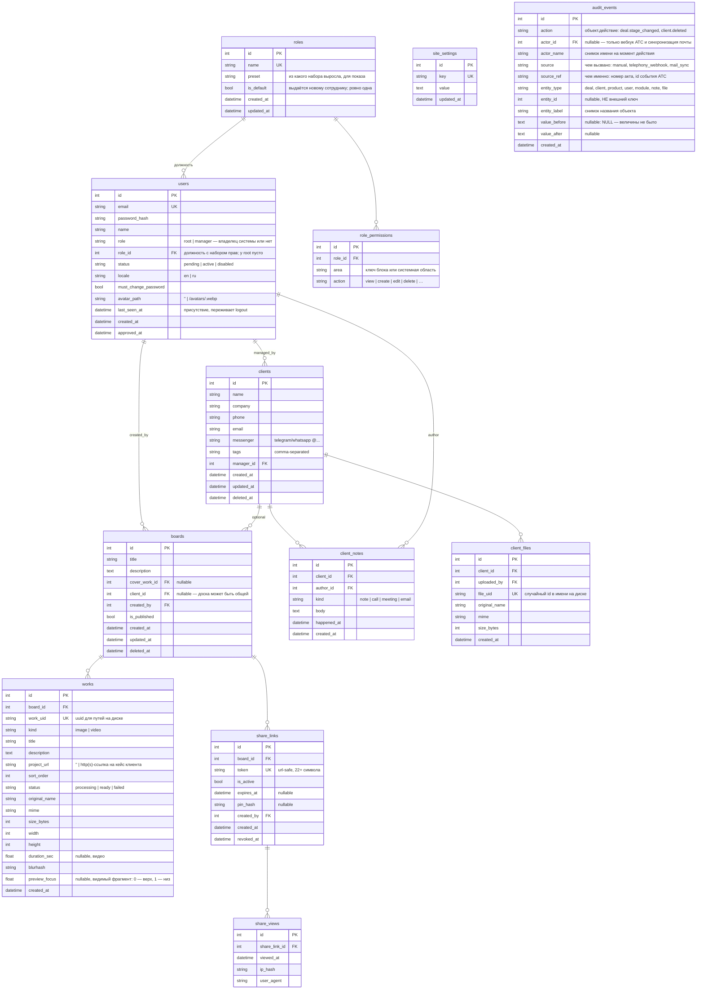
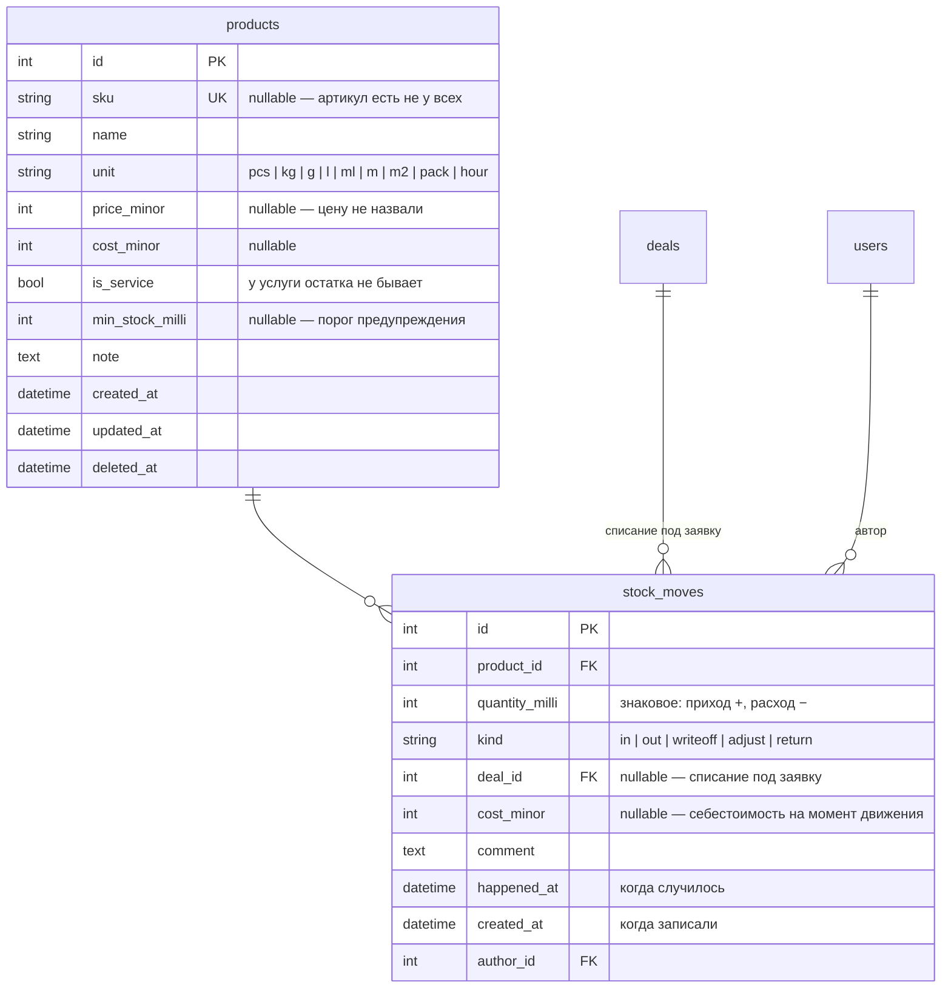

# 03 — База данных

## Принципы

- **База одна — MySQL.** Частичных индексов в ней нет, поэтому инварианты «ровно один» держатся запросами; диалектных веток в запросах нет тоже — тонкости движка собраны в `database/types.py` и `database/query.py`, а не размазаны по репозиториям.
- Все таблицы — через SQLAlchemy-модели в `database/models/`, изменения схемы — только через миграции Alembic.
- Первичные ключи — целочисленные автоинкременты; внешние публичные идентификаторы (токены ссылок, идентификаторы файлов) — отдельные случайные строки, чтобы не светить порядковые номера наружу.
- Время — всегда UTC, колонки `*_at` типа `DateTime`.
- Клиенты удаляются мягко (`deleted_at`) и восстанавливаются root'ом; их файлы чистятся отложенно. Доски восстановления не имеют, поэтому удаляются сразу вместе с файлами работ (мягкое удаление лишь занимало бы место).

## Схема



## Пояснения к решениям

### users
- `role` — только `root` и `manager`, и это **не должность, а признак владельца системы**. Набор прав живёт в `role_id`; у root его нет и быть не может — права у него все и всегда, иначе можно было бы собрать конфигурацию, в которой раздать их обратно уже некому. Первый root создаётся скриптом bootstrap при первом запуске (email/пароль из env, `must_change_password = true`). Дальше root может сделать root'ом активного сотрудника, поэтому владельцев может быть несколько; система следит, чтобы хотя бы один остался (см. [07-security.md](07-security.md)).
- `role_id` — должность с набором прав, `ON DELETE SET NULL`: удаление роли не должно уносить людей. Пусто — прав нет никаких. Роль в работе удалить нельзя (`role_in_use`), так что «пусто» появляется только осознанным снятием.
- `status = pending` после регистрации: вход запрещён до одобрения. Root меняет на `active` (одобрить) или аккаунт удаляется (отклонить). `disabled` — уволенный сотрудник: вход запрещён, данные и авторство сохраняются. Аккаунт можно и удалить окончательно (`DELETE /staff/{id}`): запись и сессии стираются, но авторство в клиентах/досках/заметках/файлах обнуляется (`ON DELETE SET NULL`), а не удаляется.
- `locale` — выбранный язык интерфейса; по умолчанию `en`. Применяется при каждом входе с любого устройства.

### roles / role_permissions
- **Что бывает — знает код, кому выдано — база.** Реестр прав в `core/permissions.py`, здесь только выдача. Строка с областью, которой больше нет в реестре, ничего не даёт: проверка идёт от реестра, а не от таблицы.
- Право — **строкой, а не списком в одной колонке**: по правам спрашивают («кто может менять роли»), а не читают их целиком. Список в тексте пришлось бы разбирать в приложении на каждый такой вопрос, и инвариант «последний управляющий правами» проверялся бы перебором всех ролей. `UNIQUE (role_id, area, action)` — дубль не ошибка данных, а мусор, который живёт своей жизнью: снимаешь право, а оно остаётся.
- `is_default` — ровно одна роль, и следит за этим **сервис, а не база**, ровно как с основной фирмой: частичный уникальный индекс (`UNIQUE ... WHERE is_default`) запрещён принципами выше ради переезда на MySQL, а обычный `UNIQUE` запретил бы двум ролям одновременно *не* быть основной.
- `preset` — из какого готового набора роль выросла, только для показа. Сверяться с пресетом никто не будет: набор в нём может измениться с обновлением, а права роли после создания живут своей жизнью.

### clients
- `tags` — строка с разделителями для MVP (поиск через LIKE). При переезде на MySQL и росте — вынести в таблицы `tags`/`client_tags` (заложено в план, изменение локальное благодаря репозиторию).
- `source` — откуда пришёл клиент: стабильный строковый ключ (`referral`, `search`, `social`, `ads`, `repeat`, `other`) либо своё значение. Колонкой, а не ссылкой на справочник: у источника нет ни вида, ни порядка, ни архивации — платить за одно редактируемое название внешним ключом и join'ом в каждом отчёте не за что. Понадобятся названия и цвета — рядом появится `client_sources` с тем же ключом, и клиентов переносить не придётся. `NULL` («не спросили») и `other` («спросили, ответ — другое») — разные значения, отчёт показывает их отдельными строками.
- `manager_id` — «ответственный» менеджер; на права видимости в MVP не влияет (видят все сотрудники), только отображается.
- `search_text` — склейка `name`, `company`, `phone`, `phone_norm`, `email`, `tags` в нижнем регистре, `deferred` (в списках её никто не показывает, а тянуть удвоенный текст каждой карточки в память не за что). Индекса нет — см. «Регистронезависимый поиск» и раздел про индексы. Сама `phone_norm` при этом остаётся: телефония ищет карточку по ней **равенством**, и это единственный быстрый путь в проекте.

### boards / works
- `works.sort_order` — целое с шагом 10 (10, 20, 30...): drag-and-drop меняет порядок без переписывания всех строк.
- `cover_work_id` — обложка доски: показывается в списках CRM и в OG-превью ссылки. По умолчанию — первая работа.
- `is_published` — черновик/опубликована. Неопубликованная доска по ссылке показывает «доступ закрыт» даже при активном токене — менеджер может спокойно готовить контент.
- `works.status = processing` — файл загружен, превью ещё генерируются; витрина такие работы не показывает, CRM показывает с индикатором.
- `works.project_url` — ссылка на кейс клиента: каждая работа на витрине может быть отдельным проектом. Пустая строка = кнопки перехода нет. Пускаются только `http(s)` (ссылка уходит в `href` на публичной странице), см. [10-showcase-cases.md](10-showcase-cases.md).
- `works.preview_focus` — какой фрагмент работы попадает на витрину: 0 — верх картинки, 1 — низ. Форму места задаёт композиция, поэтому высота обрезки не хранится. `NULL` = от верха. Обрезана работа или нет — не хранится тоже: это производное от её сторон и формы её места, а место меняется от перестановки соседей (`layout.is_cropped`, см. [06-showcase-design.md](06-showcase-design.md)).

### share_links
- Токен — `secrets.token_urlsafe(16)` → 22 url-safe символа, неугадываемый. Уникален глобально.
- У доски может быть **несколько** ссылок одновременно (например, разным клиентам с разными PIN и сроками) — поэтому отдельная таблица, а не поля в `boards`.
- «Перегенерировать» = отозвать текущую (`is_active = false, revoked_at = now`) + создать новую. История сохраняется.
- `pin_hash` — bcrypt от PIN; сам PIN показывается менеджеру один раз при установке.
- Проверка доступности ссылки (все условия обязаны выполняться): `is_active = true` **и** (`expires_at` пуст **или** в будущем) **и** доска `is_published = true` **и** доска не удалена.

### share_views
- Пишется одна запись на просмотр (открытие страницы с успешным доступом; ввод PIN — после успешного ввода).
- `ip_hash` — хэш IP с солью, не сырой адрес: достаточно для отличия уникальных посетителей, без хранения персональных данных.
- Агрегаты для CRM (`count`, `last viewed`) считаются запросом; при росте — денормализовать счётчик в `share_links`.

### mail_accounts / mail_messages (блок «Почта»)

- `mail_accounts` — ящики фирмы, настройка уровня компании (правит только root). `password_encrypted` — обратимо зашифрованный пароль (см. [07-security.md](07-security.md)); `NULL` = пароль не задан, это не то же самое, что пустая строка. `last_sync_at = NULL` — ящик не читали ни разу: по нулю нельзя отличить новый ящик от сломанного. `last_error = NULL` — ошибок не было.
- `mail_messages` — зеркало переписки: заголовки, оба тела, адресаты. **Историю общения показывает не эта таблица, а `client_notes`**: письмо при появлении порождает запись общей ленты (`kind='email'`, `direction='in'|'out'`, `happened_at` = момент отправки письма, `deal_id` — если письмо про заявку). Так переписка стоит в одном ряду со звонками и встречами, а не рядом отдельным списком.
- `message_id` **уникален** — на нём держится идемпотентность синхронизации: то же письмо, приехавшее второй раз (сменился UIDVALIDITY, переехал ящик), не задваивает ни запись, ни строку ленты. Побочный эффект: письмо, пришедшее сразу на два наших ящика, сохранится один раз — для ленты клиента это верно, разговор был один.
- `uid = NULL` у исходящих: на сервере входящей почты их нет. Ноль — законный UID, поэтому именно `NULL`.
- `sent_at` — момент отправки письма, приведённый к UTC из зоны отправителя. Не момент синхронизации: иначе вся почта, забранная одним заходом, встала бы в ленте единым столбиком «сегодня».
- `body_text`/`body_html` объявлены `deferred`: выборка списка писем их не читает — письмо на сотни килобайт не редкость, а в списке нужны только заголовки.
- Внешние ключи: `account_id → mail_accounts` **CASCADE** (без доступа к серверу зеркало не обновить; история общения при этом остаётся в ленте и от ящика не зависит), `client_id → clients` и `deal_id → deals` — **SET NULL**: карточку вычистили из корзины, а переписка остаётся. Это документы фирмы, по ним разбираются и после ухода клиента.
- Входящее письмо привязывается к клиенту по адресу отправителя, но **не к заявке**: у клиента их бывает несколько сразу, и «взять последнюю открытую» — угадывание. Клиент — факт (адрес совпал), заявка — решение человека.
### products / stock_moves (блок «Склад»)



- **Остатка среди колонок нет и не будет.** Остаток равен `SUM(quantity_milli)`
  по товару и считается запросом (`database/repositories/warehouse.py`). Хранимое
  число однажды разойдётся с историей — из-за отката, правки задним числом,
  второго процесса, — и способа узнать, какая из двух цифр верна, не останется.
  Понадобится кэш — он заводится отдельной таблицей и сверяется с этим запросом,
  но источником правды не становится никогда.
- `quantity_milli` — целое в **тысячных долях** единицы: дробные килограммы и
  метры существуют, а float в учёте теряет сотые доли на каждой операции. Три
  знака закрывают граммы и миллилитры; лишние знаки API отвергает, а не
  округляет — молчаливое округление и есть причина, по которой одно и то же
  списывают дважды.
- `products.sku` — `NULL`, а не пустая строка: артикул есть не у всех, а две
  пустые строки нарушили бы уникальность. `NULL` в уникальном индексе не
  конфликтует в MySQL.
- `stock_moves.product_id` — `ON DELETE RESTRICT`: снести товар вместе с
  движениями значит бесшумно переписать себестоимость прошлых заявок. Штатный
  путь удаления — `products.deleted_at`.
- `stock_moves.deal_id` — `ON DELETE SET NULL`: товар со склада ушёл, и удаление
  заявки не возвращает его на полку. Исчезни движение вместе с заявкой — остаток
  вырос бы сам собой, и никто бы не понял почему.
- Уход остатка в минус **разрешён** и помечается в ответе API: в жизни товар
  отдают раньше, чем заносят приход. Запрет заставил бы либо не записывать
  расход, либо выдумывать приход — обе лжи хуже честного «−3».
### finance_rules и снимки на операции (блок «Финансы»)

Правило отвечает на один вопрос: **что начислить само, когда деньги двинулись.**

| Колонка | Смысл |
|---|---|
| `base` | вид начисления, закрытый набор в коде: `income_percent` (процент с каждого прихода — налог с оборота), `per_order` (фиксированная сумма на закрытый заказ — упаковка, доставка) |
| `category_id` | **куда** ложится начисленное. `RESTRICT` |
| `source_category_id` | **с чего** считаем: вид дохода. Пусто — со всякого прихода. `RESTRICT`, nullable |
| `rate_bp` | ставка в **базисных пунктах** — сотых долях процента: 5% = 500, эквайринг 1,4% = 140. Единица в имени, как у `price_minor` и `quantity_milli` |
| `amount_minor` | фиксированная сумма. Пусто у процентных правил |
| `is_active` | «сейчас не считаем». Правило на месте, история цела |
| `deleted_at` | «правила больше нет». Мягко, как у статьи: на правило ссылаются начисления |

**Одна таблица, а не `tax_rates` + `fixed_costs`.** Эквайринг — не налог и не
фиксированная сумма; при двух таблицах под него понадобилась бы третья. Вид
начисления описан одним полем с закрытым набором ключей, поэтому `order_percent`
и привязка к товару добавятся новым значением ключа, а не новой таблицей.
Величины при этом лежат **двумя** колонками: процент и сумма — разные единицы, и
склеенные в одно поле они врут при первом же чтении без оглядки на `base`.

**Не JSON в `site_settings`.** Правило — справочник: по нему нужны
`WHERE`/`JOIN`/`GROUP BY`, на него ссылается начисление внешним ключом, его
правят двое сразу (а `settings_repo.write` переписывает строку целиком и молча
гасит чужую правку), и `schema_check` полей внутри JSON не видит вовсе — то самое
третье состояние «работает, но схема не та». JSON-функции к тому же
запрещены переносимостью.

**Ставки миграцией не засеваются.** Справочник статей засевается (`d4e1a83c2f60`)
— операцию без статьи завести нельзя; ставки наоборот: чужая налоговая ставка,
появившаяся молча при обновлении, начнёт откладывать деньги без спроса.

#### Снимки на `finance_operations`

| Колонка | Смысл |
|---|---|
| `rule_id` | какое правило породило. `RESTRICT`: снести правило вместе с историей нельзя |
| `origin` | **снимок** «чем вызвано»: `order_closed` (провели заказ) \| `payment` (пришли деньги). Пусто у платежей и у ручных операций |
| `rate_bp` | **снимок** ставки на момент начисления |
| `base_amount_minor` | с какой суммы считали. Обратно из суммы и ставки не выводится: округление необратимо |
| `document_id` | каким бланком вызван приход. `SET NULL`: удаление бумаги не отменяет того, что деньги получены |
| `corrects_id` | какую операцию эта уточняет (self-FK, `SET NULL`) |
| `correction` | `reversal` \| `adjustment`. Одним полем, а не двумя флажками: «и отмена, и поправка» не бывает |

Ссылки на правило **без снимка не хватает**: сумму правила правят на месте
(упаковка вышла дороже — 80 стало 140), поэтому ссылка после правки покажет новую
цифру, а начислено было по старой. Тот же приём в проекте ещё в четырёх местах:
`document_lines.price_minor` рядом с `product_id`, `documents.payload`,
`stock_moves.cost_minor`, `audit_events.actor_name`.

Версионирования справочника (`valid_from`/`valid_to`) нет намеренно: это второй
ответ на тот же вопрос, а два ответа однажды разойдутся.

`origin` — снимок не про деньги, а **про отмену**. Отмена проведения заказа
отыгрывает назад только то, что породило само закрытие (`order_closed`), и не
трогает налог: тот начислен ПЛАТЕЖОМ и на бланке заказа оказался лишь потому, что
платёж назвал бланк. Снятый отменой заказа, он оставил бы живой оборот при нулевом
налоге — а следующий шаг (человек возвращает деньги отдельным действием) снял бы
его второй раз, уже с отрицательной базы, и прибыль выросла бы из воздуха.

Отбор идёт по снимку, а не по `finance_rules.base` живого правила, ровно по тому
же доводу, что и у `rate_bp`: `base` правят на экране, и вчерашняя «упаковка»,
ставшая процентом с прихода, уехала бы из своей корзины задним числом. Побочно
это делает отбор устойчивым к новым видам правил — эквайринг заведёт своё
значение ключа, а «порождено закрытием заказа» останется прежним, без перечисления
видов.

#### Округление названо вслух

**К ближайшей минорной единице; ровная половина — вверх по модулю, симметрично
для обоих знаков.** Целочисленно, без `float`, без `Decimal`, без `round()`:

```
scaled = base_minor * rate_bp
(scaled + 5000) // 10000   если scaled >= 0
-((-scaled + 5000) // 10000)  иначе
```

5% от 12 345 = 617 (точно 617,25 — ближе к 617). Симметрия не украшение:
несимметричное округление оставляет копейку налога на каждом отменённом платеже,
и через год «отложено налога» перестаёт сходиться с нулём по полностью
возвращённым заказам. Выражение то же, что в `document_service.total_minor`, и
оттуда же второе правило — **округлять на итоге, а не на каждой строке**.

#### Что здесь считается запросом и не хранится

Оборот, прибыль, налог к уплате за период, **получено по заказу и по заявке**,
**остаток к оплате**, **«оплачен»**, расходы по заказу с учётом поправок,
«сколько раз сработало правило». Колонок `paid_at`, `is_paid`, `payments_total`,
`documents.paid_total`, `finance_rules.accrued_total` нет и не появится.

Хранятся только `rate_bp`, `base_amount_minor` и сумма на момент начисления — и
это **не производное, а факт**: пересчитать их нельзя в принципе, потому что
правило с тех пор поменяли. Разница проверяется одним вопросом: «можно ли
получить это число заново из первичных записей?» Оборот — можно. Ставку, по
которой начислили в марте, — нельзя. Ровно то же различие, что между «остаток
склада» и «себестоимость на момент движения».

Понятия «платёж» отдельной таблицей нет: платёж — это доходная
`FinanceOperation` со ссылкой на бланк. Отдельная таблица `payments` была бы
вторым местом, где лежат деньги, и оборот пришлось бы считать двумя запросами.

### phone_calls (блок `telephony`)

| Колонка | Смысл |
|---|---|
| `external_id` | идентификатор звонка у АТС, **уникальный** — по нему события (начался/ответили/завершился) склеиваются в одну строку; на этом индексе держится идемпотентность приёма |
| `direction` | `in` / `out` |
| `from_number`, `to_number` | как прислала АТС: это показывают человеку и по этому перезванивают |
| `from_number_norm`, `to_number_norm` | тот же номер в сравнимом виде (`core.utils.normalize_phone`) — по нему ищут клиента |
| `started_at` | момент начала разговора, naive UTC; АТС присылает своё местное время, приведение — в `telephony_service.parse_started_at` |
| `duration_sec` | `NULL` — длительность неизвестна (звонок идёт или станция её не прислала). Это **не** `0`: ноль означает «соединились и сразу положили» |
| `outcome` | `answered` / `missed` / `busy` / `failed` / `canceled`; `NULL` — звонок ещё не завершён. Пропущенный отличается от отвеченного нулевой длительности именно здесь |
| `recording_path` | путь к записи разговора у АТС |
| `client_id`, `deal_id`, `user_id` | `ON DELETE SET NULL`: удалили карточку, заявку или сотрудника — звонок остаётся, он был |
| `note_id` | запись в общей ленте, созданная этим звонком; повторное событие правит её, а не добавляет вторую |

Клиент определяется по номеру и **не создаётся** сам (обоснование — в
`telephony_service._link_client`). У `clients` для этого появилась колонка
`phone_norm` — нормализованный телефон рядом с исходным; без неё поиск
промахивался бы на каждом варианте записи номера, и звонки не находили бы
карточку. Заполняется сервисом клиентов при сохранении и разово — в миграции.

### audit_events (журнал действий)

| Колонка | Смысл |
|---|---|
| `action` | «объект.действие»: `deal.stage_changed`, `deal.amount_changed`, `stock.move_added`, `client.deleted`, `staff.role_changed`, `module.switched` |
| `actor_id` | кто. `ON DELETE SET NULL`, как всякое авторство в проекте |
| `actor_name` | **снимок** имени. Внешний ключ обнуляется при увольнении, а имя правится в профиле — и то и другое случается ровно к тому моменту, когда в журнал приходят: за прошлый год и про уволившегося |
| `source` | чем вызвано: `manual` (рука), `telephony_webhook`, `mail_sync`. Без него не отличить «списал руками» от «списалось, потому что провёл акт» |
| `source_ref` | чем именно: номер акта, идентификатор события АТС |
| `entity_type`, `entity_id` | над чем. `entity_id` — **не** внешний ключ: журнал обязан пережить удаление того, о чём он написан, а именно удаление он и записывает. CASCADE снёс бы запись вместе с объектом, RESTRICT запретил бы удалять вовсе |
| `entity_label` | снимок названия. «client 5 удалён» не отвечает на вопрос «кого» — карточки уже нет |
| `value_before`, `value_after` | было и стало. `NULL` («величины не было») отличается от пустой строки («величина была пустой»); у действий без величины оба `NULL` |

Записи **только дописываются**: правка и удаление запрещены на уровне мэппера
(`database/models/audit.py`), ручек записи в API нет. Пишет журнал единственная
точка — `core/services/audit_service.record`, в той же транзакции, что и само
изменение. Что пишется и что намеренно не пишется — в [07-security.md](07-security.md).

Существующие поля исполнителя (`deal_stage_changes.changed_by`,
`stock_moves.author_id`, `client_notes.author_id`, `module_states.updated_by`)
журнал **не заменяет**: это рабочие данные своих блоков, по ним считаются отчёт
по этапам и остаток склада, и `source` там взяться неоткуда.

### site_settings
- Ключ-значение: `brand_name`, `brand_logo_path`, `contact_email`, `contact_phone`, `social_telegram`, `showcase_locale`, `og_default_image` и т.п.
- Тумблеры витрины хранятся строкой `"1"`/`"0"` (таблица строковая): `showcase_show_meta` — строка «7 works · updated …» под названием доски, `showcase_show_footer` — футер с контактами. Оба по умолчанию `"0"`.
- Редактирует только root. Кэшируется в памяти процесса с инвалидацией при записи.

## Жизненный цикл файлов и освобождение места

| Действие | Что с файлами |
|---|---|
| Удалить работу | файлы удаляются сразу (в т.ч. из менеджера файлов, root) |
| Удалить **ссылку** на доску | файлы **не трогаются** — они принадлежат доске, а у доски может быть несколько ссылок; удаление одной не должно ломать остальные |
| Удалить **доску** | доска, её работы, ссылки и просмотры удаляются сразу; файлы работ стираются с диска (восстановления досок нет — каскад `ondelete=CASCADE`) |
| Удалить **клиента** | мягкое удаление: запись скрыта, файлы лежат до очистки корзины (клиента можно восстановить) |
| Очистить корзину (root) или `purge_deleted.py` | мягко удалённые клиенты и их файлы удаляются безвозвратно, место освобождается |

Объём корзины (мягко удалённые клиенты) виден в карточке «Хранилище». Автоматика: cron с карантином 30 дней, см. [08-deployment.md](08-deployment.md). Обзор всех медиафайлов досок с размером/датами и точечным удалением — менеджер файлов (root), см. [05-crm-design.md](05-crm-design.md).

## Регистронезависимый поиск

Регистр не важен сам собой: сравнение MySQL по умолчанию (`utf8mb4_0900_ai_ci`) нечувствительно к нему, а нормализованная колонка поиска приводится к нижнему регистру один раз при записи — Python'ом, а не `LOWER()` в запросе. `LOWER()` стоил бы вызова на каждую строку и каждую колонку: пять на строку у клиентов, миллион на запрос по базе в 200 000 карточек.

При переезде на MySQL подмена не нужна: сравнение в `utf8mb4_general_ci` регистронезависимо нативно.

**С горячего пути поиска подмена снята.** Она остаётся для всего остального, но у клиентов и заявок сравниваются две **заранее приведённые** строки: колонка `search_text` — склейка полей в нижнем регистре, а строку запроса приводит та же `database.query.search_norm`. Ни `lower()` в SQL, ни подменённая функция в этом сравнении больше не участвуют, поэтому переезд на MySQL поведения поиска не меняет.

Цена подмены была не в аккуратности, а в скорости: каждый `lower(колонка)` — переход C→Python на **каждую строку и каждую колонку**. У клиента это пять вызовов на строку, миллион на один запрос по базе в 200 000 карточек. Замерено: клиенты 295 → 38,6 мс, заявки 354 → 96,5 мс.

Заполняется колонка **мэппер-событиями** `before_insert`/`before_update` на самих моделях, а не сервисом. У `phone_norm` сервисное заполнение уже стоило известной болезни: пишет колонку одна точка, а карточку — несколько, и запись мимо неё оставляет поле пустым молча. У поиска цена такой пустоты выше — карточка просто перестаёт находиться. Мимо мэппера проходит только массовый `update()` по таблице; сторож против этого — в `tests/test_db_boundary.py`.

Обе стороны, запись и чтение, пользуются **одной** функцией `search_norm`: разъехавшись, они дали бы молча не находящиеся карточки. Разделитель полей — перевод строки, поэтому совпадение не может перескочить границу поля (запрос «Иван Ромашка» не находит человека по имени и фирме сразу — так же, как не находил при пяти раздельных `OR`).

Поиск заявок берёт имя клиента **подзапросом**, а не соединением: соединение уводило план запроса на клиентов — двести тысяч проходов на каждый поиск. Внутри подзапроса склейка стоит дешёвым предварительным отсевом, а точное условие по-прежнему проверяет **имя**, а не всю карточку клиента. Одна склейка расширила бы выдачу молча: «ООО» стоит в названиях фирм, и заявок по нему находилось бы 32 792 вместо нуля.

### Почему в проекте не будет FTS5 и MySQL FULLTEXT

Оба «правильных» лекарства закрыты устройством проекта, и это правило дороже конкретной задачи.

FTS5 порождает пять теневых таблиц, которых нет в `Base.metadata`. На свежей установке базу строит `web/main.py:_ensure_schema` через `create_all` — значит `deals_fts` там не появится **никогда**, `schema_check` промолчит (он сверяет только модели), `/healthz` ответит 200, и поиск упадёт «no such table». Это ровно то третье состояние — «работает, но схема не та», — которого в проекте не существует и не должно появиться. Триггеры синхронизации alembic не сравнивает вовсе.

MySQL FULLTEXT хуже: он ищет по словам, а не по подстроке, — «Ромаш» не нашёл бы «Ромашку», — и требует своего синтаксиса в запросе вместо общего `LIKE`.

## Отчёты не соединяются со справочником этапов

Отчёты и сводка считаются по **виду** этапа (`open`/`won`/`lost`), а вид лежит в `pipeline_stages`. Соединять с ним заявки нельзя, и причина не в размере справочника — там два десятка строк, — а в плане запроса.

Отчёт отбирает заявки узким окном по `closed_at`: месяц из трёх лет, два процента таблицы. Пока справочник стоял в запросе, планировщик норовил вести отчёт **от него**: пять этапов наружу и по восемьдесят тысяч заявок на каждый. Оценка у такого плана — 68 строк при настоящих 78 000, потому что статистика хранит среднее число строк на значение, а разных этапов пять. Замерено на 400 000 заявок: счёт закрытых за месяц **195 мс** соединением против **6.0 мс** списком ключей, деньги за месяц — **220** против **9.8 мс**.

Поэтому `database/repositories/reports.py` и `deals_repo.money_summary` спрашивают справочник отдельным запросом (`pipeline_repo.kinds_by_key`), отбирают заявки по `stage IN (ключи)` и приписывают вид уже в Python. Множество найденного при этом не меняется ни на строку: `key` в справочнике уникален, поэтому внутреннее соединение и список ключей отбирают одно и то же, а заявка с этапом, которого в справочнике больше нет, отсеивается и там, и там. Архивные этапы в список входят — соединение их тоже не отсеивало, а закрытые сделки стоят как раз в них.

Сторожа — `test_speed.py::test_otchyot_ne_soedinyaet_zayavki_so_spravochnikom_etapov` и его двойник для сводки: смотрят на **форму** запроса, потому что соединение возвращается одной строкой, а по секундомеру на маленькой базе этого не видно вовсе.

## Индексы

| Таблица | Индекс | Зачем |
|---|---|---|
| users | `email` (unique) | вход |
| clients | `name`, `manager_id`, `deleted_at` | списки и поиск |
| clients | `source`, `created_at` | отчёт по источникам: группировка и отбор за период — иначе отчёт за год читает таблицу целиком |
| client_notes | `(client_id, happened_at)` | лента карточки |
| works | `(board_id, sort_order)` | вывод доски по порядку |
| share_links | `token` (unique) | открытие витрины — самый горячий запрос |
| share_views | `(share_link_id, viewed_at)` | статистика |
| mail_messages | `message_id` (unique) | идемпотентность синхронизации |
| mail_messages | `client_id`, `deal_id`, `sent_at` | письма в карточке клиента/заявки и порядок по дате |
| mail_messages | `(account_id, uid)` | «с какого места забирать дальше» |
| products | `sku` (unique), `name`, `deleted_at` | поиск и списки |
| stock_moves | `product_id` | внешний ключ **и** колонка группировки для остатка |
| stock_moves | `deal_id`, `author_id`, `kind`, `happened_at` | врезка в карточке заявки, фильтры и порядок истории |
| clients | `phone_norm` | звонок ищет карточку по нормализованному номеру |
| phone_calls | `external_id` (unique) | склейка событий АТС в один звонок (идемпотентность) |
| phone_calls | `from_number_norm`, `to_number_norm` | поиск звонков по номеру |
| phone_calls | `started_at`, `outcome`, `client_id`, `deal_id`, `user_id` | журнал с фильтрами и врезки в карточках |
| audit_events | `(entity_type, entity_id, created_at)` | «что делали с этой заявкой» |
| audit_events | `(actor_id, created_at)` | «что делал этот сотрудник» — он же закрывает внешний ключ на `users` |
| audit_events | `created_at` | лента журнала целиком, свежее сверху |
| finance_rules | `(is_active, sort_order)` | правила читают одним способом: живые, в порядке применения |
| finance_rules | `category_id`, `source_category_id`, `deleted_at` | внешние ключи и отбор незакрытых |
| finance_operations | `(document_id, category_id, amount_minor)` | «получено по заказу» и «расходы по заказу» — SUM по бланку, сумма обязана лежать в индексе |
| finance_operations | `rule_id`, `corrects_id` | «сколько раз сработало правило» и цепочка поправок |
| clients | `(deleted_at, updated_at)` | список клиентов: «живые, свежее сверху» — без пары сортируется вся живая выборка ради полусотни строк |
| deals | `(deleted_at, updated_at)` | то же у списка заявок |
| deals | `(deleted_at, stage, sort_order, id DESC)` | колонка канбана: отбор по этапу и порядок внутри колонки |
| deals | `(deleted_at, stage, amount)` | итоги над колонками доски и плитки сводки: `SUM(amount) GROUP BY stage` закрывается индексом целиком |

### Списки: отобрать — это половина работы

Каждый список в CRM устроен одинаково: «отбери живые и покажи полсотни свежих
сверху». Узкий индекс по `deleted_at` умеет только первую половину, и вторую база
делала заново на каждый показ — доставала всю живую выборку и строила из неё
временное дерево сортировки (`Using filesort`). Замерено на боевом объёме
(MySQL 8.0; 200 000 клиентов, 400 000 заявок, 2 700 000 движений склада;
медиана семи прогонов, «было» и «стало» сняты подряд на одном прогретом
буферном пуле):

| Экран | было | стало |
|---|---|---|
| список клиентов, стр. 1 | 208 мс | 29 мс |
| список клиентов, стр. 50 | 259 мс | 30 мс |
| список заявок, стр. 1 | 442 мс | 49 мс |
| список заявок, стр. 50 | 651 мс | 51 мс |
| доска (канбан) | 1243 мс | 172 мс |
| сводка | 890 мс | 513 мс |

Хвост `id` в парах не дописан: во вторичный индекс InnoDB кладёт первичный ключ
сам, а сортировка в проекте всегда «поле, потом id»
(`database/query._with_tiebreak`). Исключение — колонка канбана: она сортируется
`sort_order ASC, id DESC`, то есть **в разные стороны**, и такой порядок индекс
целиком по возрастанию не даёт. Отсюда убывающий хвост, который MySQL умеет с
8.0 (доска 1230 мс без него против 180 мс с ним; одна колонка — 185 против
3.5 мс).

Пары `(deleted_at, stage, sort_order, id DESC)` и `(deleted_at, stage, amount)`
снимаются только вместе. Оставь первую — планировщик возьмёт её и на суммы, а
`amount` в ней нет, и он полезет в таблицу за каждым числом: `SUM(amount) GROUP
BY stage` даёт 496 мс против 357 мс вообще без индексов и 72 мс с обеими.

Три пары на заявках начинаются с `deleted_at` не ради отбора, а чтобы **не
переманивать планы отчётов**: любой индекс, у которого `stage` стоит первым,
уводит отчёт от узкого окна по `closed_at` на обход этапов — воронка 34 → 308 мс.
Сторож на это стоит в `tests/test_speed.py`.

Пара «живые + свежие» была отвергнута в `f9b41c7e2d08` — но по замерам на SQLite,
где статистика хранит среднее число строк на значение и планировщик тащил такой
индекс в каждый запрос про живые записи. База с тех пор одна, вывод перепроверен
на ней: сводка и отчёты своих планов не меняют. Цена у пары другая и названа
ниже.

### Чего индексом не чинится

**Поиск подстрокой.** `search_text LIKE '%слово%'` не берёт индекс ни один —
ведущий `%` закрывает эту дорогу, а FTS5 и FULLTEXT закрыты устройством проекта
(разбор выше). Больше того, у пары `(deleted_at, updated_at)` есть цена, и она
ровно здесь: поиск, **не нашедший ничего**, стал медленнее (командная палитра
996 → 1292 мс, список заявок по такому слову 1272 → 1573 мс). Имея готовый
порядок, MySQL идёт по индексу и дёргает строки по первичному ключу вразнобой,
надеясь набрать полсотни совпадений раньше конца таблицы; при нуле совпадений он
доходит до конца случайными чтениями вместо последовательных. На словах, которые
находятся, пара наоборот выигрывает вдвое (палитра 930 → 426 мс, список заявок
1284 → 714 мс). Обмен принят сознательно: списки открывают десятки раз в день, а
поиск без совпадений был медленным и остаётся медленным — ускорить его индексом
нельзя в принципе.

**Точный счёт для страницы.** `page_of` вторым запросом считает «найдено N»:
25 мс на списке клиентов, 53 мс на журнале, 208 мс на движениях склада (2.7 млн
строк). Убрать его — не ускорение, а изменение поведения: из `total` считается
номер последней страницы. Там, где точное число не показывают, в проекте уже
стоит `page_without_total` (командная палитра).

**Остаток по местам.** `EXPLAIN` показывает `Using temporary` у раскладки
`GROUP BY product_id, warehouse_id`, и напрашивается
`(product_id, warehouse_id, quantity_milli)`. Замер отговаривает: вся страница
склада с остатками занимает 24 мс. Индекс — это плата за каждую запись, а
`stock_moves` несёт двенадцать индексов и пополняется чаще всех таблиц.

Колонок `clients.search_text` и `deals.search_text` в таблице нет намеренно:
**индекса у них не будет**. Подстрочный поиск с ведущим `%` его не берёт ни в
MySQL, а префиксный по склейке бессмыслен — она начинается с имени,
и «иванов» не нашёл бы «Алексея Иванова». Колонка здесь не индекс, а более
дешёвый стог сена: тот же полный проход, но без вызова `lower()` на каждое поле
каждой строки.

Индексов у `audit_events` ровно три, и это осознанно: журнал растёт быстрее всех
остальных таблиц — он пополняется на каждое значимое действие в каждом блоке, —
и каждый лишний индекс платится записью. По `action` и `source` индекса нет:
фильтр по ним всегда идёт вместе с окном по времени, а по времени индекс есть.

## Схема доводится до нужного вида сама

Правило номер один для боевого сервера: **обновление обязано привести базу к тому
виду, которого ждёт новый код**, — без человека с консолью. Держится это тремя
вещами, и работают они только вместе.

**1. Миграции идут до старта приложения.** `docker/entrypoint.sh` снимает копию
базы и выполняет `alembic upgrade head`. Скрипт под `set -e`: миграция не
прошла — контейнер не поднялся, и обновление это увидит.

Копия снимается **по тому адресу, по которому работаем**: `python -m
scripts.snapshot_db dump` кладёт `mysql.pre-migrate-<ревизия>.sql`.

Правило это записано кровью. Прежде здесь стояло «если файл базы существует» —
условие из времён, когда баз было две. На установке, переехавшей на MySQL, оно
отвечало ПРАВДОЙ и означало ЛОЖЬ: файл после переезда остаётся лежать нарочно,
условие срабатывало, и снималась копия базы, которой никто не пользуется, а
следом шли миграции по рабочей. Копии рабочей базы не было вовсе, и неудачное
обновление откатывало код, а базу откатывать было нечем.

Правила у копии такие: **имя по ревизии, с которой уходим; существующую не
перезаписываем; держим последние пять.** Повторный старт на той же ревизии
ничего не переписывает — именно на этом однажды и погорели: копия обновлялась на
каждом старте и затиралась перезапуском, случившимся уже ПОСЛЕ неудачной
миграции.

**Нет миграций к накату — нет и копии.** Точка входа спрашивает голову
(`python -m alembic heads`, в базу этот вопрос не ходит) и сравнивает с ревизией
базы. Совпали — накатывать нечего, портить нечему, возвращаться не к чему.

Это ответ на измеренный размен. Копия 2,7 млн строк — это 85 с и дамп на 1,2 ГБ,
а полный старт до первого ответа `/healthz` — 89,55 с при потолке ожидания у
автообновления в 120 с: на базе примерно от 3,6 млн строк ИСПРАВНОЕ обновление
начинало бы откатываться само. Вторая половина размена — нехватка места: пока
копии на MySQL не было, она подняться не мешала, а с копией дамп падает и сайт
не стартует ни разу. Забить же диск проще всего этими самыми копиями.

Копия при этом не «стала необязательной»: она снимается ровно на том старте,
ради которого заводилась, — на первом после обновления, привёзшего миграции. А
обычный перезапуск контейнера, перезагрузка машины и цикл рестартов перестают
стоить полутора минут и гигабайта каждый. Голову прочитать не удалось или голов
несколько — копия снимается, как раньше: незнание не повод её пропустить.

Оборванный дамп называется `.part` и следующим стартом не принимается; огрызки
прошлых ревизий убираются тем же стартом — под маску `*.sql` они не попадают и
раньше лежали вечно.

Клиента MySQL в образе приложения нет и не будет: `mysqldump` живёт в образе
базы, а точка входа работает внутри контейнера приложения. Почему дамп пишется
своим кодом на `pymysql` (который в зависимостях обязателен), а не докладыванием
клиента в образ — разобрано в шапке `scripts/snapshot_db.py`. Копия дописывается
меткой конца и проверяется по ней сразу после снятия: оборванный дамп — обычный
текстовый файл, и негодность у него не видна ничем, кроме отсутствующего хвоста.
Восстановление — заходом в контейнер базы, где клиент есть (тем же способом, что
у обычных копий, см. `scripts/backup.sh`).

**2. `create_all` на населённой базе запрещён.** `web/main.py:_ensure_schema`
различает пустую базу и населённую: пустую строит `create_all` + `stamp head`,
населённую проводит только миграциями. Безусловный `create_all` (как было
раньше) на населённой базе создаёт новые ТАБЛИЦЫ, не отмечаясь в
`alembic_version`, и не добавляет КОЛОНОК вовсе. Оба расхождения молчат: первое
до следующего обновления («table already exists»), второе — до первого запроса к
новому полю.

**3. Схема сверяется с моделями.** `database/schema_check.py` сравнивает живую
базу с `Base.metadata`:

| Что нашли | Как поступаем | Почему |
|---|---|---|
| нет таблицы, нет колонки | приложение не поднимается | от этого падают запросы |
| лишняя таблица или колонка | строка в лог | обычно след отката, а откат отбирать нельзя |
| типы колонок | не сверяем | MySQL приводит объявленное к своему набору; ловит `tests/test_schema_conventions.py` |

Отсюда обещание: `/healthz` отвечает `{"status": "ok", "schema": "ok"}` только
при сошедшейся схеме, а `deploy/updater.py`, не дождавшись 200, **откатывает и
код, и базу**. Состояния «работает, но схема не та» не существует.

Проверено попыткой сломать: `ALTER TABLE products DROP COLUMN note` на стенде →
приложение не поднялось с сообщением «нет колонок: products.note», `/healthz`
отдал 503, контейнер ушёл в цикл перезапуска.

Посмотреть состояние: `./opencrm.sh doctor` (строка «схема базы»), подробности —
`GET /api/v1/system/schema` под правом `settings.manage`.

### Как писать миграцию на населённую базу

Порядок строгий, иначе не пройдёт: колонку `NOT NULL` нельзя добавить сразу — на
первой же существующей строке всё встанет.

1. создать новые таблицы;
2. засеять то, на что будут ссылаться (пример — склад «Основной» в
   `b2c8e4f1a396`);
3. добавить колонку **nullable**;
4. заполнить её **одним `UPDATE`**, а не построчным обходом через ORM: двести
   тысяч движений через ORM — это минуты вместо секунд;
5. `batch_alter_table` → `NOT NULL` и внешние ключи (в MySQL это обычный
   `ALTER`, но форма записи одна на все миграции);
6. индексы — последними, по уже заполненным данным.

`downgrade` обязан работать: откат — главный способ починки на боевом сервере.

## База одна — MySQL

Прежде их было две: SQLite по умолчанию и MySQL для тех, кому мало. Довод в
пользу файла был честный — ничего не требует, лежит одним файлом, на нагрузке
одной студии не уступает, — но отвечал он не на тот вопрос. У SQLite **ровно
один писатель**, поэтому второй рабочий процесс на ней невозможен, а значит
установка, начатая «попроще», рано или поздно упирается в переезд: закрытый сайт
и самая опасная операция, какая в проекте есть. Телефония упиралась в это сразу
— четыре одновременных события об одном разговоре давали `500`
(`sqlite3.OperationalError: database is locked`), и лечилось это не таймаутом.

Боевой сервер переехал, одноразовый сценарий переезда вырезан, и осталась одна
база. Цена названа вслух: образ MySQL — около 600 МБ, сервер — порядка 400 МБ
памяти сверх сайта. Redis обязателен рядом: в нём общий на все процессы счётчик
попыток входа и PIN.

Адрес базы живёт в `config/.env` (`OPENCRM_DB_URL`), пароль тот же установщик
кладёт в `docker/.env`. Умолчания у адреса нет: придуманное означало бы
«приложение пошло не туда, куда думал человек», а на пустой базе это выглядит
как потерянные данные. Пустой или не-MySQL адрес — отказ старта с внятной
строкой (`config/settings.py:config_errors`), и он же ловится на воротах
обновления до подмены сайта (`python -m config.selfcheck`).

### Набор тестов гоняется на ней же

Другой базы у продукта нет, и набор на чужом движке бывает зелёным, ничего при
этом не обещая. Проверено дважды и дорого: на файловой базе проходила проверка
двойного нажатия «Запросить доступ», а на MySQL она давала `500`; на файловой
держалась защита «последний владелец», а на MySQL двое владельцев снимали root
друг с друга разом и запирали систему насмерть. Обе беды были на боевом сервере
всё время, и не видел их только набор.

Поэтому `tests/conftest.py` требует `OPENCRM_TEST_DB_URL` и отказывается
стартовать без него. Поднять базу вместе с набором:

```sh
docker compose -f docker/docker-compose.tests.yml up --build     --abort-on-container-exit --exit-code-from tests
```

База эфемерная: своё имя проекта, своя сеть, данные в tmpfs. Тем же файлом
пользуются ворота обновления (`deploy/updater.py:_checks`) и CI.

### Телеграм: диалоги и сообщения

Две таблицы, обе растут. Таблицы аккаунтов нет: бот один на всю систему.

| Таблица | Что хранит | Чего опасаться |
|---|---|---|
| `telegram_chats` | диалог: идентификатор чата, подпись, номер, связь с карточкой, метка источника, время последнего сообщения | `client_id` пуст — **нормальное состояние**, а не ошибка: привязка по неточному совпадению запрещена |
| `telegram_messages` | сообщения: направление, вид, текст, вложение, состояние отправки | Растёт быстрее всего в системе. Потолок и уборка старого — решение владельца, а не молчаливое удаление: переписка бывает доказательством |

Отдельно стоит знать три вещи.

**`chat_id` — `BigInteger`.** Телеграм давно выдаёт идентификаторы больше двух
миллиардов, и `Integer` здесь стоил бы приёма сообщений: значение проходит нашу
проверку и упирается в чужую, а обработчика на `DataError` нет.

**`last_message_at` хранится, хотя это производное, и это НЕ нарушение
правила.** Правило запрещает хранить то, что разойдётся с истиной незаметно:
остаток склада, себестоимость. Здесь расхождение безвредно и самозаживает —
следующее сообщение перезапишет, — а без колонки список диалогов требует
соединения с самой быстрорастущей таблицей на каждый показ.

**Живого состояния в базе нет вовсе.** Кто смотрит диалог и до какого места
дочитал — производное от того, кто сейчас на связи; оно живёт в Redis ключами
со сроком годности. Колонка «непрочитано» означала бы число, которое однажды
разойдётся с правдой и будет молчать об этом.

