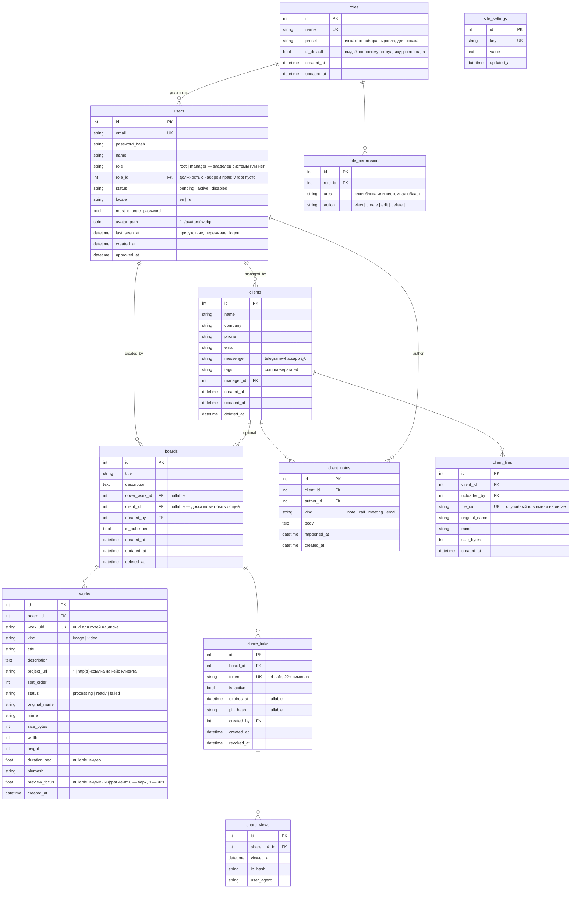
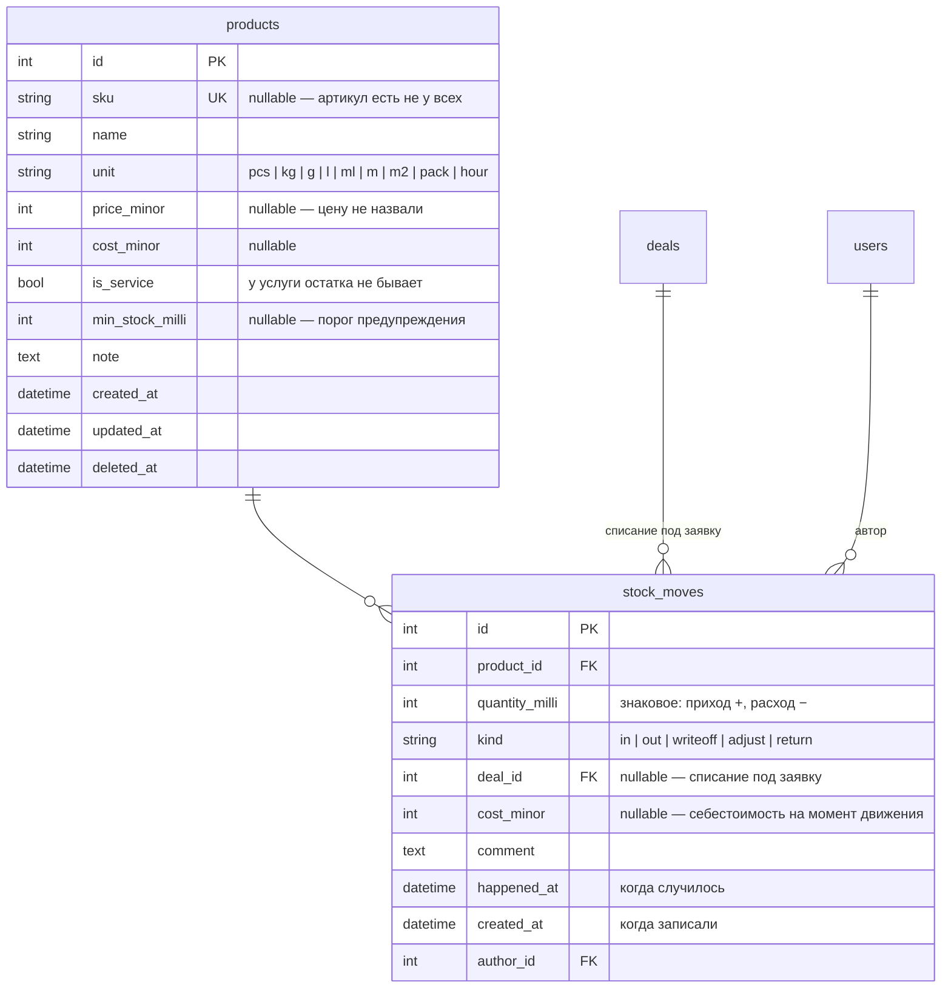

# 03 — База данных

## Принципы

- **SQLite сейчас, MySQL потом.** Поэтому: никаких диалект-специфичных фич (JSON-функций SQLite, `AUTOINCREMENT`-трюков, частичных индексов). Только то, что SQLAlchemy переносит без правок.
- Все таблицы — через SQLAlchemy-модели в `database/models/`, изменения схемы — только через миграции Alembic.
- Первичные ключи — целочисленные автоинкременты; внешние публичные идентификаторы (токены ссылок, идентификаторы файлов) — отдельные случайные строки, чтобы не светить порядковые номера наружу.
- Время — всегда UTC, колонки `*_at` типа `DateTime`.
- Клиенты удаляются мягко (`deleted_at`) и восстанавливаются root'ом; их файлы чистятся отложенно. Доски восстановления не имеют, поэтому удаляются сразу вместе с файлами работ (мягкое удаление лишь занимало бы место).

## Схема

## Пояснения к решениям

### users
- `role` — только `root` и `manager`, и это **не должность, а признак владельца системы**. Набор прав живёт в `role_id`; у root его нет и быть не может — права у него все и всегда, иначе можно было бы собрать конфигурацию, в которой раздать их обратно уже некому. Первый root создаётся скриптом bootstrap при первом запуске (email/пароль из env, `must_change_password = true`). Дальше root может сделать root'ом активного сотрудника, поэтому владельцев может быть несколько; система следит, чтобы хотя бы один остался (см. [07-security.md](07-security.md)).
- `role_id` — должность с набором прав, `ON DELETE SET NULL`: удаление роли не должно уносить людей. Пусто — прав нет никаких. Роль в работе удалить нельзя (`role_in_use`), так что «пусто» появляется только осознанным снятием.
- `status = pending` после регистрации: вход запрещён до одобрения. Root меняет на `active` (одобрить) или аккаунт удаляется (отклонить). `disabled` — уволенный сотрудник: вход запрещён, данные и авторство сохраняются. Аккаунт можно и удалить окончательно (`DELETE /staff/{id}`): запись и сессии стираются, но авторство в клиентах/досках/заметках/файлах обнуляется (`ON DELETE SET NULL`), а не удаляется.
- `locale` — выбранный язык интерфейса; по умолчанию `en`. Применяется при каждом входе с любого устройства.

### roles / role_permissions
- **Что бывает — знает код, кому выдано — база.** Реестр прав в `core/permissions.py`, здесь только выдача. Строка с областью, которой больше нет в реестре, ничего не даёт: проверка идёт от реестра, а не от таблицы.
- Право — **строкой, а не списком в одной колонке**: по правам спрашивают («кто может менять роли»), а не читают их целиком. Список в тексте пришлось бы разбирать в приложении на каждый такой вопрос, и инвариант «последний управляющий правами» проверялся бы перебором всех ролей. `UNIQUE (role_id, area, action)` — дубль не ошибка данных, а мусор, который живёт своей жизнью: снимаешь право, а оно остаётся.
- `is_default` — ровно одна роль, и следит за этим **сервис, а не база**, ровно как с основной фирмой: частичный уникальный индекс (`UNIQUE ... WHERE is_default`) запрещён принципами выше ради переезда на MySQL, а обычный `UNIQUE` запретил бы двум ролям одновременно *не* быть основной.
- `preset` — из какого готового набора роль выросла, только для показа. Сверяться с пресетом никто не будет: набор в нём может измениться с обновлением, а права роли после создания живут своей жизнью.

### clients
- `tags` — строка с разделителями для MVP (поиск через LIKE). При переезде на MySQL и росте — вынести в таблицы `tags`/`client_tags` (заложено в план, изменение локальное благодаря репозиторию).
- `source` — откуда пришёл клиент: стабильный строковый ключ (`referral`, `search`, `social`, `ads`, `repeat`, `other`) либо своё значение. Колонкой, а не ссылкой на справочник: у источника нет ни вида, ни порядка, ни архивации — платить за одно редактируемое название внешним ключом и join'ом в каждом отчёте не за что. Понадобятся названия и цвета — рядом появится `client_sources` с тем же ключом, и клиентов переносить не придётся. `NULL` («не спросили») и `other` («спросили, ответ — другое») — разные значения, отчёт показывает их отдельными строками.
- `manager_id` — «ответственный» менеджер; на права видимости в MVP не влияет (видят все сотрудники), только отображается.

### boards / works
- `works.sort_order` — целое с шагом 10 (10, 20, 30...): drag-and-drop меняет порядок без переписывания всех строк.
- `cover_work_id` — обложка доски: показывается в списках CRM и в OG-превью ссылки. По умолчанию — первая работа.
- `is_published` — черновик/опубликована. Неопубликованная доска по ссылке показывает «доступ закрыт» даже при активном токене — менеджер может спокойно готовить контент.
- `works.status = processing` — файл загружен, превью ещё генерируются; витрина такие работы не показывает, CRM показывает с индикатором.
- `works.project_url` — ссылка на кейс клиента: каждая работа на витрине может быть отдельным проектом. Пустая строка = кнопки перехода нет. Пускаются только `http(s)` (ссылка уходит в `href` на публичной странице), см. [10-showcase-cases.md](10-showcase-cases.md).
- `works.preview_focus` — какой фрагмент длинной работы попадает на витрину: 0 — верх картинки, 1 — низ. Форму места задаёт композиция, поэтому высота обрезки не хранится. `NULL` = от верха; заполняется только у длинных картинок, см. [06-showcase-design.md](06-showcase-design.md).

### share_links
- Токен — `secrets.token_urlsafe(16)` → 22 url-safe символа, неугадываемый. Уникален глобально.
- У доски может быть **несколько** ссылок одновременно (например, разным клиентам с разными PIN и сроками) — поэтому отдельная таблица, а не поля в `boards`.
- «Перегенерировать» = отозвать текущую (`is_active = false, revoked_at = now`) + создать новую. История сохраняется.
- `pin_hash` — bcrypt от PIN; сам PIN показывается менеджеру один раз при установке.
- Проверка доступности ссылки (все условия обязаны выполняться): `is_active = true` **и** (`expires_at` пуст **или** в будущем) **и** доска `is_published = true` **и** доска не удалена.

### share_views
- Пишется одна запись на просмотр (открытие страницы с успешным доступом; ввод PIN — после успешного ввода).
- `ip_hash` — хэш IP с солью, не сырой адрес: достаточно для отличия уникальных посетителей, без хранения персональных данных.
- Агрегаты для CRM (`count`, `last viewed`) считаются запросом; при росте — денормализовать счётчик в `share_links`.

### mail_accounts / mail_messages (блок «Почта»)

- `mail_accounts` — ящики фирмы, настройка уровня компании (правит только root). `password_encrypted` — обратимо зашифрованный пароль (см. [07-security.md](07-security.md)); `NULL` = пароль не задан, это не то же самое, что пустая строка. `last_sync_at = NULL` — ящик не читали ни разу: по нулю нельзя отличить новый ящик от сломанного. `last_error = NULL` — ошибок не было.
- `mail_messages` — зеркало переписки: заголовки, оба тела, адресаты. **Историю общения показывает не эта таблица, а `client_notes`**: письмо при появлении порождает запись общей ленты (`kind='email'`, `direction='in'|'out'`, `happened_at` = момент отправки письма, `deal_id` — если письмо про заявку). Так переписка стоит в одном ряду со звонками и встречами, а не рядом отдельным списком.
- `message_id` **уникален** — на нём держится идемпотентность синхронизации: то же письмо, приехавшее второй раз (сменился UIDVALIDITY, переехал ящик), не задваивает ни запись, ни строку ленты. Побочный эффект: письмо, пришедшее сразу на два наших ящика, сохранится один раз — для ленты клиента это верно, разговор был один.
- `uid = NULL` у исходящих: на сервере входящей почты их нет. Ноль — законный UID, поэтому именно `NULL`.
- `sent_at` — момент отправки письма, приведённый к UTC из зоны отправителя. Не момент синхронизации: иначе вся почта, забранная одним заходом, встала бы в ленте единым столбиком «сегодня».
- `body_text`/`body_html` объявлены `deferred`: выборка списка писем их не читает — письмо на сотни килобайт не редкость, а в списке нужны только заголовки.
- Внешние ключи: `account_id → mail_accounts` **CASCADE** (без доступа к серверу зеркало не обновить; история общения при этом остаётся в ленте и от ящика не зависит), `client_id → clients` и `deal_id → deals` — **SET NULL**: карточку вычистили из корзины, а переписка остаётся. Это документы фирмы, по ним разбираются и после ухода клиента.
- Входящее письмо привязывается к клиенту по адресу отправителя, но **не к заявке**: у клиента их бывает несколько сразу, и «взять последнюю открытую» — угадывание. Клиент — факт (адрес совпал), заявка — решение человека.
### products / stock_moves (блок «Склад»)

- **Остатка среди колонок нет и не будет.** Остаток равен `SUM(quantity_milli)`
  по товару и считается запросом (`database/repositories/warehouse.py`). Хранимое
  число однажды разойдётся с историей — из-за отката, правки задним числом,
  второго процесса, — и способа узнать, какая из двух цифр верна, не останется.
  Понадобится кэш — он заводится отдельной таблицей и сверяется с этим запросом,
  но источником правды не становится никогда.
- `quantity_milli` — целое в **тысячных долях** единицы: дробные килограммы и
  метры существуют, а float в учёте теряет сотые доли на каждой операции. Три
  знака закрывают граммы и миллилитры; лишние знаки API отвергает, а не
  округляет — молчаливое округление и есть причина, по которой одно и то же
  списывают дважды.
- `products.sku` — `NULL`, а не пустая строка: артикул есть не у всех, а две
  пустые строки нарушили бы уникальность. `NULL` в уникальном индексе не
  конфликтует ни в SQLite, ни в MySQL.
- `stock_moves.product_id` — `ON DELETE RESTRICT`: снести товар вместе с
  движениями значит бесшумно переписать себестоимость прошлых заявок. Штатный
  путь удаления — `products.deleted_at`.
- `stock_moves.deal_id` — `ON DELETE SET NULL`: товар со склада ушёл, и удаление
  заявки не возвращает его на полку. Исчезни движение вместе с заявкой — остаток
  вырос бы сам собой, и никто бы не понял почему.
- Уход остатка в минус **разрешён** и помечается в ответе API: в жизни товар
  отдают раньше, чем заносят приход. Запрет заставил бы либо не записывать
  расход, либо выдумывать приход — обе лжи хуже честного «−3».
### phone_calls (блок `telephony`)

| Колонка | Смысл |
|---|---|
| `external_id` | идентификатор звонка у АТС, **уникальный** — по нему события (начался/ответили/завершился) склеиваются в одну строку; на этом индексе держится идемпотентность приёма |
| `direction` | `in` / `out` |
| `from_number`, `to_number` | как прислала АТС: это показывают человеку и по этому перезванивают |
| `from_number_norm`, `to_number_norm` | тот же номер в сравнимом виде (`core.utils.normalize_phone`) — по нему ищут клиента |
| `started_at` | момент начала разговора, naive UTC; АТС присылает своё местное время, приведение — в `telephony_service.parse_started_at` |
| `duration_sec` | `NULL` — длительность неизвестна (звонок идёт или станция её не прислала). Это **не** `0`: ноль означает «соединились и сразу положили» |
| `outcome` | `answered` / `missed` / `busy` / `failed` / `canceled`; `NULL` — звонок ещё не завершён. Пропущенный отличается от отвеченного нулевой длительности именно здесь |
| `recording_path` | путь к записи разговора у АТС |
| `client_id`, `deal_id`, `user_id` | `ON DELETE SET NULL`: удалили карточку, заявку или сотрудника — звонок остаётся, он был |
| `note_id` | запись в общей ленте, созданная этим звонком; повторное событие правит её, а не добавляет вторую |

Клиент определяется по номеру и **не создаётся** сам (обоснование — в
`telephony_service._link_client`). У `clients` для этого появилась колонка
`phone_norm` — нормализованный телефон рядом с исходным; без неё поиск
промахивался бы на каждом варианте записи номера, и звонки не находили бы
карточку. Заполняется сервисом клиентов при сохранении и разово — в миграции.

### site_settings
- Ключ-значение: `brand_name`, `brand_logo_path`, `contact_email`, `contact_phone`, `social_telegram`, `showcase_locale`, `og_default_image` и т.п.
- Тумблеры витрины хранятся строкой `"1"`/`"0"` (таблица строковая): `showcase_show_meta` — строка «7 works · updated …» под названием доски, `showcase_show_footer` — футер с контактами. Оба по умолчанию `"0"`.
- Редактирует только root. Кэшируется в памяти процесса с инвалидацией при записи.

## Жизненный цикл файлов и освобождение места

| Действие | Что с файлами |
|---|---|
| Удалить работу | файлы удаляются сразу (в т.ч. из менеджера файлов, root) |
| Удалить **ссылку** на доску | файлы **не трогаются** — они принадлежат доске, а у доски может быть несколько ссылок; удаление одной не должно ломать остальные |
| Удалить **доску** | доска, её работы, ссылки и просмотры удаляются сразу; файлы работ стираются с диска (восстановления досок нет — каскад `ondelete=CASCADE`) |
| Удалить **клиента** | мягкое удаление: запись скрыта, файлы лежат до очистки корзины (клиента можно восстановить) |
| Очистить корзину (root) или `purge_deleted.py` | мягко удалённые клиенты и их файлы удаляются безвозвратно, место освобождается |

Объём корзины (мягко удалённые клиенты) виден в карточке «Хранилище». Автоматика: cron с карантином 30 дней, см. [08-deployment.md](08-deployment.md). Обзор всех медиафайлов досок с размером/датами и точечным удалением — менеджер файлов (root), см. [05-crm-design.md](05-crm-design.md).

## Регистронезависимый поиск

Встроенные `lower()`/`upper()` в SQLite работают только с ASCII: `lower('Брусника')` возвращает строку без изменений, поэтому `ilike` (SQLAlchemy эмулирует его через `lower()`) не находил русские названия, набранные в другом регистре. В [database/session.py](../database/session.py) обе функции подменяются Python-реализациями через `create_function` — это чинит поиск во всех репозиториях сразу и не требует диалектных веток в запросах.

При переезде на MySQL подмена не нужна: сравнение в `utf8mb4_general_ci` регистронезависимо нативно.

## Индексы

| Таблица | Индекс | Зачем |
|---|---|---|
| users | `email` (unique) | вход |
| clients | `name`, `manager_id`, `deleted_at` | списки и поиск |
| clients | `source`, `created_at` | отчёт по источникам: группировка и отбор за период — иначе отчёт за год читает таблицу целиком |
| client_notes | `(client_id, happened_at)` | лента карточки |
| works | `(board_id, sort_order)` | вывод доски по порядку |
| share_links | `token` (unique) | открытие витрины — самый горячий запрос |
| share_views | `(share_link_id, viewed_at)` | статистика |
| mail_messages | `message_id` (unique) | идемпотентность синхронизации |
| mail_messages | `client_id`, `deal_id`, `sent_at` | письма в карточке клиента/заявки и порядок по дате |
| mail_messages | `(account_id, uid)` | «с какого места забирать дальше» |
| products | `sku` (unique), `name`, `deleted_at` | поиск и списки |
| stock_moves | `product_id` | внешний ключ **и** колонка группировки для остатка |
| stock_moves | `deal_id`, `author_id`, `kind`, `happened_at` | врезка в карточке заявки, фильтры и порядок истории |
| clients | `phone_norm` | звонок ищет карточку по нормализованному номеру |
| phone_calls | `external_id` (unique) | склейка событий АТС в один звонок (идемпотентность) |
| phone_calls | `from_number_norm`, `to_number_norm` | поиск звонков по номеру |
| phone_calls | `started_at`, `outcome`, `client_id`, `deal_id`, `user_id` | журнал с фильтрами и врезки в карточках |

## Миграция SQLite → MySQL

1. Все типы уже переносимые; Alembic-миграции написаны без диалектных веток.
2. Перенос данных: скрипт `scripts/migrate_to_mysql.py` — читает через SQLAlchemy из SQLite, пишет в MySQL (порядок: users → clients → boards → works → остальное).
3. Меняется `OPENCRM_DB_URL`, прогоняются миграции на пустой MySQL, затем перенос, затем переключение приложения.
4. Файлы в `storage/` не затрагиваются — пути в БД относительные.
5. После переезда: `utf8mb4`, движок InnoDB — задаётся в Alembic `env.py` через `mysql_*`-аргументы, SQLite их игнорирует.
