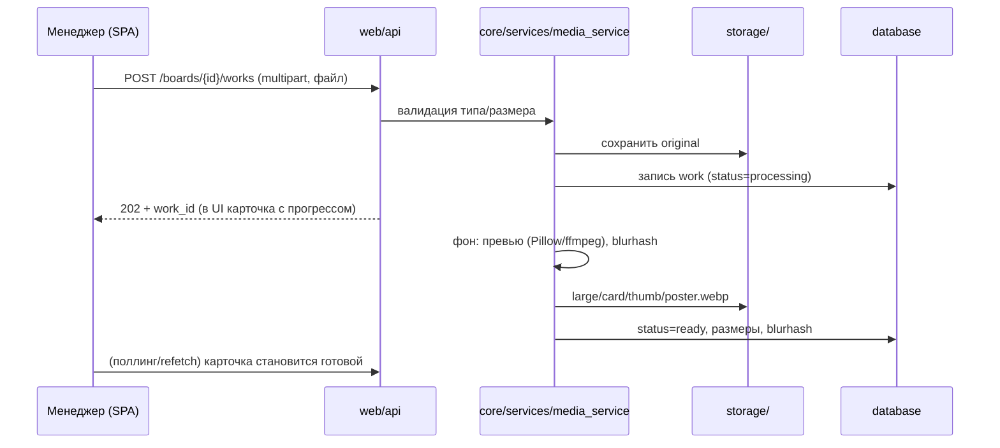

# 02 — Архитектура

## Стек

| Слой | Технология | Почему |
|---|---|---|
| Бэкенд | **Python 3.12 + FastAPI** | Требование проекта (Python); FastAPI — асинхронный, типизированный, автодокументация OpenAPI |
| ORM / миграции | **SQLAlchemy 2.0 + Alembic** | Схема доводится до нужного вида миграциями, сама, до старта приложения |
| СУБД | **MySQL 8.0, `utf8mb4`** | База у продукта одна. Тонкости движка — сравнение строк, смещение страницы, шаблоны в LIKE, тип итога агрегата — собраны в двух файлах (`database/types.py`, `database/query.py`), а не разложены по двум диалектам сразу. `charset=utf8mb4` в адресе обязателен: без него соединение договаривается о трёхбайтном utf8, и эмодзи в заметке клиента обрывает вставку на полуслове |
| Кэш и общее состояние | **Redis 7** | Не «ускоритель на будущее», а условие работоспособной защиты. Счётчик неудачных попыток обязан быть общим на все рабочие процессы: в памяти процесса восемь воркеров дают восьмикратный порог — без единой ошибки, снаружи защита выглядит работающей (`core/ratelimit.py`, разбор — в шапке `core/redis_client.py`). На нём же шина живого состояния и присутствие (`core/realtime.py`). Служба в compose стоит без профиля, а пустой `OPENCRM_REDIS_URL` в production останавливает старт |
| Валидация | **Pydantic v2** | Схемы запросов/ответов, конфигурация из env |
| Фронтенд CRM | **React 18 + TypeScript + Vite** | SPA для внутреннего инструмента: быстрая разработка, богатые интерактивные списки/формы |
| Витрина | **серверный HTML (Jinja2) + ванильный JS** | Сервер отдаёт готовую страницу с OG-мета-тегами и первым экраном. Сборки у витрины нет вовсе: один шаблон `web/public/templates/showcase.html`, внутри инлайновый CSS и инлайновый скрипт — лайтбокс и декодер blurhash (base83 → canvas 32×32) написаны руками. Ради двух этих вещей заводить вторую сборку не за что |
| Стили | **CSS-токены (custom properties)** | Ручная таблица стилей с токенами из дизайн-макетов — без сборочных зависимостей. Токены CRM лежат в `web/frontend/crm/src/styles.css`, токены витрины — в `` её шаблона. (В доке ранее значился Tailwind — заменён осознанно: макеты Claude Design дали готовую систему классов) |
| Анимации витрины | **CSS-переходы и `@keyframes`** | Там же, в шаблоне: анимировать нечего, кроме появления плиток и лайтбокса. `prefers-reduced-motion: reduce` уважается — `base.html` сводит длительности к нулю, а скрипт при нём не включает ни свой курсор, ни автовоспроизведение видео в сетке |
| Обработка изображений | **Pillow** | Превью, WebP-версии, blurhash-плейсхолдеры |
| Обработка видео | **ffmpeg** (системный, вызов из Python) | Постеры видео, метаданные длительности |
| Фоновое в запросе | **FastAPI BackgroundTasks** | Ровно одно место — обработка медиа после загрузки (`web/api/routes/boards.py`). Вынос в arq/celery когда-то планировался и не состоялся: отдельный воркер стоит отдельной службы в развёртывании, а поводов для него по-прежнему один |
| Периодические работы | **юниты systemd на хосте** | Три таймера (утренняя сводка 09:00, резервная копия 03:30, уборка старой переписки 04:30, пояс `Europe/Kyiv`) и служба автообновления — `deploy/systemd/`. На хосте, а не в контейнере: то, что пересоздаёт контейнеры и снимает с них копии, не может внутри них жить. Разбор — в [08-razvyortyvanie.md](../ekspluatatsiya/08-razvyortyvanie.md) |
| Веб-сервер | **uvicorn за nginx** | nginx терминирует TLS, ограничивает поток на входах и отдаёт с диска логотип с аватарами; всё остальное — включая медиа витрин — проксирует в приложение |
| Контейнеризация | **Docker + Docker Compose** | Один `docker compose up` на VPS |

## Структура каталогов

```
OpenCRM/
├── config/                     # Конфигурация
│   ├── settings.py             #   Pydantic Settings: env-переменные, пути, лимиты, разбор ошибок конфига
│   ├── selfcheck.py            #   тот же разбор в отрыве от запуска: обновление спрашивает
│   │                           #   «поднимется ли новый код на этой машине» ДО подмены контейнера
│   └── .env.example            #   шаблон окружения (без секретов)
│
├── core/                       # Доменная логика (не знает про HTTP и SQL напрямую)
│   ├── modules.py              #   реестр блоков системы: какие бывают, какие несущие, что от чего зависит
│   ├── permissions.py          #   реестр прав: области и осмысленные в них действия
│   ├── events.py               #   шина доменных событий: блок объявляет, что у него произошло
│   ├── subscriptions.py        #   кто на что подписан — одним списком
│   ├── realtime.py             #   живое состояние: шина сообщений и присутствие (в Redis)
│   ├── redis_client.py         #   тонкий слой доступа к Redis
│   ├── ratelimit.py            #   ограничитель попыток: N неудач за окно → отказ
│   ├── references.py           #   ссылки из тела запроса: указанное существует (иначе 500 на опечатку)
│   ├── uniqueness.py           #   вставка строки с уникальным полем: гонка двух вкладок не даёт 500
│   ├── exceptions.py           #   доменные ошибки → HTTP-коды на слое web
│   ├── utils.py                #   мелочь без своего места: разбор почты, пороги «в сети»
│   ├── security/               #   пароли (bcrypt), токены сессий, PIN-хэши, secretbox —
│   │                           #   обратимое шифрование прикладных секретов (пароль почты, токен бота)
│   └── services/               #   бизнес-операции, суффикс `_service`; по службе на предметную область
│       ├── ядро                #     auth, client, deal, pipeline, lead, company, task
│       ├── доски и медиа       #     board, share, media
│       ├── бумага и деньги     #     document, act, template, codes (штрихкод и QR бланка),
│       │                       #     finance, report, svodka
│       ├── склад и заказы      #     warehouse, order, barcode (штрихкоды товара)
│       ├── каналы              #     telegram (+ uborka), telephony (+ providers), mail (+ transport)
│       └── служебные           #     modules, permissions, audit, monitoring, trevogi, maintenance,
│                               #     storage, settings, avatar, site_logo, files, arcade
│
├── database/                   # Слой данных
│   ├── models/                 #   SQLAlchemy-модели: по файлу на предметную область блока
│   ├── repositories/           #   запросы к БД (только здесь пишем SQL/ORM-запросы)
│   ├── migrations/             #   Alembic
│   ├── schema_check.py         #   сверка живой схемы с `Base.metadata`; не сошлась — приложение не поднимается
│   ├── query.py                #   общие приёмы страниц и поиска: отрицательное смещение,
│   │                           #   экранирование `%` и `_` в LIKE, тип итога агрегата
│   ├── types.py                #   типы колонок с явно заданным поведением MySQL: регистр и хвостовые
│   │                           #   пробелы при сравнении, длина ключа под индексом, умолчание у TEXT
│   └── session.py              #   engine, фабрика сессий, снятие именованных замков
│
├── web/                        # Слой HTTP
│   ├── api/                    #   REST API для CRM SPA (/api/v1/...)
│   │   ├── deps.py             #     транзакция запроса, текущий сотрудник, права, ограничители
│   │   ├── schemas.py          #     pydantic-схемы ответов
│   │   ├── cards.py            #     сборка карточек из нескольких источников
│   │   └── routes/             #     по модулю на блок системы; полный перечень монтируется
│   │                           #     в `web/main.py:create_app`
│   ├── public/                 #   публичные страницы: витрина, PIN, печатные бланки, статус заказа
│   │   │                       #   по номеру бланка, страница обслуживания, приём заявок с формы сайта
│   │   ├── routes.py           #     страницы витрины и PIN, раздача медиа, логотипа и аватаров,
│   │   │                       #     словари en/ru этих страниц
│   │   ├── leads.py            #     приём заявки с сайта по ключу приёма
│   │   ├── layout.py           #     модульная сетка витрины
│   │   ├── document_strings.py #     тексты печатных бланков: ru, en, uk
│   │   ├── templates/          #     Jinja2: showcase, pin, *_print, document_status,
│   │   │                       #     maintenance_mode, closed
│   │   └── static/             #     шрифты и фавиконки витрины, лежат в образе
│   ├── frontend/crm/           #   исходники React-SPA: src/{components, screens, lib, styles.css}
│   ├── middleware.py           #   режим обслуживания и заголовки безопасности, на голом ASGI
│   └── main.py                 #   сборка FastAPI-приложения, монтирование роутеров
│
├── storage/                    # Файлы (в .gitignore, том Docker)
│   ├── media/                  #   оригиналы и производные работ
│   ├── client_files/           #   внутренние документы клиентов
│   ├── avatars/                #   аватары сотрудников
│   └── branding/               #   логотип и картинка для соцсетей
│
├── docker/                     # Dockerfile, docker-compose.yml, конфиг nginx, entrypoint.sh
│                               # (копия базы и `alembic upgrade head` до старта), monitoring/ — стек наблюдения
├── deploy/                     # автообновление: работает на хосте, вне контейнеров
├── scripts/                    # bootstrap root-аккаунта, бэкапы, обслуживание
├── tests/                      # плоский набор pytest; сторожа границ поимённо названы в CLAUDE.md
├── docs/                       # эта документация
└── opencrm.sh                  # мастер установки и меню управления сервером
```

`deploy/` намеренно стоит особняком и не импортирует ни `core`, ни `web`, ни `config`:
обновляющий не может зависеть от того, что он обновляет. Он работает на хосте — внутри
контейнера он не пережил бы собственный деплой, — и обходится одной стандартной библиотекой,
потому что на сервере может не быть ни venv проекта, ни рабочего образа. Подробности — в
[08-razvyortyvanie.md](../ekspluatatsiya/08-razvyortyvanie.md).

### Опоры модульности в `core/`

Три механизма, на которых держится обещание «блок выключается без вреда для
остальных». Они не вспомогательные модули, и потому стоят отдельным разговором,
а не строкой в дереве.

**`core/modules.py` — реестр блоков.** Здесь только описание: какие блоки
бывают, какие из них несущие, что от чего зависит. Включено или выключено —
состояние, оно живёт в базе (`core/services/modules_service.py`). Разделение
принципиальное: код — источник правды о том, какие блоки существуют, база —
только о том, какие из них нужны этому бизнесу. Иначе строка в базе от
снесённого блока продолжала бы «включать» то, чего в коде уже нет. Блок
появляется в реестре, когда он написан: переключатель для того, чего нет, — это
обещание, а не функция, поэтому запланированные помечены `ready=False` и не
включаются. Подробности — в [11-bloki-i-svyaznost.md](11-bloki-i-svyaznost.md).

**`core/permissions.py` — реестр прав, и матрица строится ПО реестру блоков.**
Появился блок — появилась строка с базовым набором действий, сама. Список,
набранный вручную, разошёлся бы с реестром на первом же новом блоке и разошёлся
бы молча: право на несуществующий раздел никто не проверит, а раздел без права
открыт всем. Особые действия («выпустить бланк», «сменить этап») объявляются
поимённо — их по ключу блока не угадать.

**`core/events.py` + `core/subscriptions.py` — связь блоков событием, а не
прямым вызовом.** Блоки связаны полями (`deal_id` есть у бланков, движений,
писем, звонков и задач), но не поведением. Прямые вызовы работают, пока блоков
три; их больше десяти, и каждый следующий требовал бы правки старых — старые
начали бы знать о новых, и «выключить блок» перестало бы быть безопасным
действием. Отсюда главное обещание модульности: **выключенный блок просто не
подписан.** Не проверка `is_enabled` в десяти местах, которую забудут в
одиннадцатом, а отсутствие вызова; проверка одна и стоит в диспетчере. Работает
синхронно и в той же транзакции — без очередей и брокера: асинхронность стоит
отдельной службы в развёртывании и отбирает атомарность, ровно то, ради чего всё
затевалось (списание со склада обязано отменяться вместе с актом). Подписки
собраны одним списком в `subscriptions.py` по той же причине, по которой заведён
сам механизм: на вопрос «что от чего срабатывает» должно отвечать одно место, а
не обход десяти файлов с grep'ом.

### Правила зависимостей между слоями

```
web  ──►  core  ──►  database/repositories
 │                            ▲
 └────────────────────────────┘
   репозиторий звать можно; сочинять свой запрос — нет
```

- **Запросы живут только в `database/`.** За его пределами никто не называет
  таблицу или колонку в запросе: ни `select(...)`, ни `db.execute`, ни
  `db.scalar`, ни `db.get(Модель, id)`. Репозиторий при этом зовут и `core`, и
  `web` — граница проведена по запросу, а не по слою.
- Граница проверяется механически — `tests/test_db_boundary.py`, со списком
  названных исключений. Договорённость, которую стережёт только внимательность,
  живёт до первого спешащего дня: следующий блок допишут прямо в сервисе,
  потому что так на две минуты быстрее.
- `db.add`, `db.delete`, `db.flush` сервису оставлены: они работают с записью,
  которая уже на руках, своего SQL не сочиняют и от движка не зависят. Запрос —
  сочиняет, и именно в нём живут тонкости движка.
- `core` не знает про FastAPI, `database` не знает ни о ком, `config`
  импортируется отовсюду и сам не импортирует слои.

Это дисциплинирует код и делает смену фронтенда или переезд на другой движок
локальным изменением, а не сквозной правкой двадцати сервисов.

### Транзакция запроса закрывается ДО отдачи ответа

Одна транзакция на запрос, и открывает её `web/api/deps.get_db`: `commit` на
выходе, `rollback` на исключении. Важна не только развилка, но и **момент**, в
который она срабатывает.

FastAPI разбирает зависимости с `yield` в `AsyncExitStack`, и по умолчанию
(`scope="request"`) этот стек закрывается **после** отправки ответа. А `commit`
в MySQL — сетевой круг, и следующий запрос браузера его обгоняет.

Замерено (вход, сразу `GET /auth/me`, двадцать раз): **9 промахов из 20**, с
паузой в секунду — 0 из 20. На стенде с 2,7 млн строк —
17 промахов из 20. Тот же самый cookie, только что получивший 401
`session_invalid`, через секунду отвечает 200 пять раз из пяти: сессия была
записана, просто позже ответа. Снаружи это «ввёл пароль и тут же выкинуло»
примерно у половины входов — и касается не одного входа, а **всего, что пишет и
сразу читается**: завели клиента и открыли карточку, перевели заявку и
перечитали её.

Поэтому у транзакции стоит `scope="function"`: FastAPI кладёт такую зависимость
в стек, который закрывается **до** `await response(...)`. Объявлено это один раз
— внутри самого `get_db`, а не в двухстах местах, где его спрашивают: забытый
`scope` в новом маршруте вернул бы беду молча и только на этом маршруте.

Живые обновления держатся на том же решении: намёк «перечитай» копится в сессии
и уходит слушателем `after_commit`, а не из обработчика — иначе сосед перечитал
бы прежнее состояние ([12-zhivye-obnovleniya.md](../ustroystvo/12-zhivye-obnovleniya.md) §4).

Доменный отказ при этом по-прежнему откатывает: исключение поднимается через тот
же стек, и ветка `except` срабатывает раньше, чем обработчик доменных ошибок
построит ответ. Сторожа — `tests/test_commit_before_response.py` (порядок
событий) и `tests/test_transaction_boundary.py` (отказ не оставляет половины
записи); нужны оба, поодиночке каждый проходит и на неверном поведении.

Сюда же относится правило из шапки `web/middleware.py`: посредники написаны на
голом ASGI, а не через `@app.middleware("http")`. Тот разворачивается в
`BaseHTTPMiddleware`, который отдаёт ответ потоком из отдельной задачи — и
сдвигает те же два события в том же неверном порядке.

На той же границе снимаются именованные замки MySQL — `snyat_zamki(db)` в
`finally` у `_edinica_raboty`, между `commit` и `close`. Место выбрано
вынужденно, и оно единственное: такой замок держится за соединением, и ни
`COMMIT`, ни `ROLLBACK`, ни `Session.close()` его не снимают — последняя лишь
возвращает соединение в пул. Снять раньше фиксации тоже нельзя: замок стоит
затем, чтобы соперник не прошёл прежде, чем чужая запись станет видимой, и
снятый до `COMMIT` он не делает ничего. Проверено дуэлью: со снятием внутри
сервиса форма с сайта по-прежнему заводила две карточки на одну заявку. Отказ
самого снятия проглатывается намеренно — функция работает рядом с закрытием
сессии, в том числе когда запрос уже падает, и исключение отсюда подменило бы
настоящую причину отказа своей.

## Хранение файлов

Все загружаемые файлы — на диске сервера (том Docker), в БД — только метаданные и относительные пути.

```
storage/
├── media/
│   └── {work_uid}/                 # один каталог на работу, назван её опознавателем
│       │                           # (uuid4 без дефисов, 32 hex); доски в пути нет
│       ├── original.{ext}          # исходник изображения как загрузили
│       ├── image.svg               # у SVG исходник он же и есть: обработки нет, на витрину
│       │                           # уходит сам файл (санитайзится при загрузке)
│       ├── video.mp4 / video.webm  # исходник видео
│       ├── large.webp              # 1920px по длинной стороне — лайтбокс
│       ├── card.webp               # 800px — карточка в сетке витрины
│       ├── thumb.webp              # 320px — списки в CRM
│       └── poster.webp             # только для видео: кадр-постер
├── client_files/
│   └── {client_id}/{file_uid}{ext}
├── avatars/
│   └── {uuid}.webp
└── branding/
    └── logo.{ext}, site-logo.{ext}, og-default.{ext}
```

Правила:

- Имена файлов на диске — только идентификаторы, оригинальное имя хранится в БД (защита от инъекций в путь и проблем с кодировками). Фавиконки сюда не попадают вовсе: они статика образа (`web/public/static/`), а не загруженный файл.
- **Наружу может уйти только имя из `PUBLIC_FILENAMES`** (`core/services/media_service.py`) — производные и SVG-исходник. Список белый, а не чёрный, и лежит рядом с кодом: перечень запрещённого всегда неполон, потому что перечисляет то, о чём вспомнили. Исходника изображения и видео в списке нет.
- **Медиа витрины отдаёт приложение** (`web/public/routes.py:media_file`), nginx только проксирует. На каждый файл проверяется, включён ли блок досок и открыта ли эта работа сессии или предъявленному PIN (`share_service.media_is_public`). Раньше nginx раздавал медиа прямо с диска, и файл не закрывался ничем: клиент один раз открыл витрину и запомнил адреса картинок — после смены PIN, отзыва ссылки, истечения срока и снятия доски с публикации страница отвечала 401/404, а файлы 200, анониму и вовсе без PIN. То есть **отзыв ссылки не отзывал ничего** (`4a180dc`).
- Приём `X-Accel-Redirect` (приложение проверяет доступ, байты отдаёт nginx) был бы быстрее и **не взят нарочно**. Такой ответ живёт ровно до тех пор, пока внутренний адрес в конфиге nginx совпадает с заголовком в коде, а файлы nginx примонтированы из чекаута и меняются в момент `git checkout` — то есть раньше, чем пересоберётся контейнер приложения. В это окно новое приложение встречает старый конфиг, заголовок уходит в никуда, и на витринах у всех клиентов пропадают картинки. Разбор — в `docker/nginx/templates/locations.inc`.
- Внутренние файлы клиентов (`client_files`) отдаются **только через приложение** с проверкой права `clients.view` (`web/api/routes/clients.py:download_file`).
- С диска nginx отдаёт лишь `/branding/` и `/avatars/`: логотип, картинка для соцсетей и аватары проверкой не закрыты — закрывать их не от кого. Те же пути умеет отдавать и приложение (запуск без nginx), и там имя сверяется с белым списком: `logo.`, `site-logo.`, `og-default.` для бренда, расширение `.webp` для аватара.

## Пайплайн загрузки работы



- Тип файла проверяется по сигнатуре (magic bytes), не по расширению.
- Изображения: JPG, PNG, WebP, GIF, SVG (SVG — санитайзинг, отдача с безопасным `Content-Type`).
- Видео: MP4 (H.264), WebM. Постер — кадр на 1-й секунде.
- Blurhash сохраняется в БД → витрина рисует размытые цветные плейсхолдеры до загрузки картинок.

## Витрина: почему серверный HTML, а не SPA

1. **OG-превью в мессенджерах.** Telegram/WhatsApp не исполняют JS. Сервер обязан отдать `<meta property="og:image" ...>` с обложкой доски — это то самое «красивое превью» при отправке ссылки.
2. **Скорость первого экрана.** HTML приходит уже с сеткой первых работ (blurhash-плейсхолдеры) — витрина «появляется» мгновенно, JS догружает интерактив.
3. **Надёжность.** Даже при сбое JS клиент увидит работы: базовая сетка и просмотр работают на чистом HTML/CSS.

Бандла у витрины при этом нет вовсе. Всё, что ей нужно от JS, — лайтбокс,
декодер blurhash и беззвучное автовоспроизведение видео в сетке; это помещается
в сам шаблон. Второй фронтенд рядом с CRM означал бы вторую сборку, второй набор
зависимостей и второй способ сломаться при обновлении — ради трёх скриптов.

CRM при этом остаётся обычной SPA — там SEO и мгновенный первый экран не нужны, а интерактивность важнее.

## Интернационализация

Словари живут в трёх местах, и это не разброд, а три разных ответа на вопрос
«чей это язык».

- **Интерфейс CRM** — `web/frontend/crm/src/lib/i18n.ts`, `en`/`ru`. Язык сотрудника хранится в `users.locale` и применяется после входа на любом устройстве.
- **Серверные страницы витрины и PIN** — словарями в `web/public/routes.py` (`en`/`ru`). Язык витрины задаётся в настройках сайта (root): её читает клиент, а не сотрудник.
- **Печатные бланки** — `web/public/document_strings.py`, и языков там **три**: `ru`, `en`, `uk`. Отдельным файлом потому, что бумага живёт своей жизнью: язык бланка выбирают под клиента — приехал турист, печатаем по-английски, — а интерфейс мастера при этом остаётся русским.

Язык по умолчанию — **английский**.

## Конфигурация

Всё через переменные окружения (Pydantic Settings), файл `config/.env.example` — источник правды по списку:

```
OPENCRM_ENV=production
OPENCRM_SECRET_KEY=...            # сессии; пусто в production — отказ старта
OPENCRM_DB_URL=mysql+pymysql://opencrm:ПАРОЛЬ@db:3306/opencrm?charset=utf8mb4
OPENCRM_REDIS_URL=redis://:ПАРОЛЬ@redis:6379/0   # пусто в production — отказ старта
OPENCRM_IP_HASH_SALT=...          # соль хэша IP в журнале просмотров; пусто в production — отказ старта
OPENCRM_TRUSTED_PROXY_HOPS=1      # сколько ДОВЕРЕННЫХ прокси стоит впереди
OPENCRM_STORAGE_DIR=./storage     # в шаблоне так; внутри контейнера — /app/storage
OPENCRM_ROOT_EMAIL=...            # bootstrap root при первом запуске
OPENCRM_ROOT_PASSWORD=...         # принудительная смена при первом входе
OPENCRM_MAX_UPLOAD_MB=200
OPENCRM_DISK_WARNING_PERCENT=80   # предупреждение по занятому месту
OPENCRM_DISK_CRITICAL_PERCENT=90  # «критично»
OPENCRM_DISK_MIN_FREE_MB=1024     # аварийный запас: ниже него загрузка файлов блокируется
OPENCRM_BASE_URL=https://studio.example.com   # для генерации публичных ссылок и OG
```

Три пометки «отказ старта» — не строгость ради строгости. Пустой секрет или
пустая соль означают не «работаем чуть слабее», а «защиты нет», причём снаружи
это выглядит работающим; из двух зол дешевле не подняться. Тот же разбор
вынесен в `config/selfcheck.py`, чтобы обновление могло спросить «а новый код на
этой машине вообще поднимется» **до** подмены контейнера: иначе отказ по конфигу
случается уже после неё, сайт лежит, `/healthz` молчит и обновление откатывает
код вместе с базой. Так и вышло на боевом сервере, когда Redis стал
обязательным.

`OPENCRM_TRUSTED_PROXY_HOPS` смотрится мелочью, но от неё зависит, какому адресу
в `X-Forwarded-For` верить, — то есть весь ограничитель подбора PIN и хэш IP в
журнале просмотров. Разбор — в [07-bezopasnost.md](../ekspluatatsiya/07-bezopasnost.md).

`OPENCRM_WORKERS` живёт не здесь, а в `docker/.env`: его читает `entrypoint.sh`,
поднимая uvicorn. Значение больше единицы без `OPENCRM_REDIS_URL` останавливает
старт — восемь процессов дают восемь независимых счётчиков попыток и
восьмикратный порог защиты, не порождая ни одной ошибки.
